# Design Document: SkyNet - Global Aviation Logistics & Management System

## Overview

SkyNet is a modular Python console application implementing nine interconnected aviation logistics subsystems, each showcasing specific data structures and algorithms. The system is designed for an HNC/HND Data Structures and Algorithms unit targeting Distinction grade.

The architecture follows clean OOP principles with abstract base classes, inheritance hierarchies, and polymorphism. A service layer separates business logic from data structure internals, while a console UI layer provides menu-driven interaction. The project targets Python 3.10+ with no external dependencies beyond the standard library (plus `pytest` for testing).

**Key Design Decisions:**
- **Pure Python implementation** — no third-party data structure libraries; all structures built from scratch to demonstrate understanding
- **Abstract base classes** — define common interfaces for data structures, enabling polymorphic substitution
- **Service layer pattern** — business logic in service classes that compose data structures rather than exposing them directly
- **Separation of concerns** — UI code never touches internal data structure state; all interaction via public methods

## Architecture

### High-Level Architecture

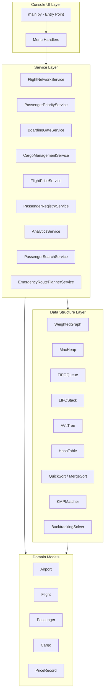

### Package Structure

```
skynet/
├── __init__.py
├── main.py                     # Entry point, main menu loop
├── models/
│   ├── __init__.py
│   ├── airport.py              # Airport data model
│   ├── flight.py               # Flight/route data model
│   ├── passenger.py            # Passenger data model
│   ├── cargo.py                # Cargo item data model
│   └── price_record.py         # Price record data model
├── graph/
│   ├── __init__.py
│   ├── weighted_graph.py       # Adjacency list weighted graph
│   ├── dijkstra.py             # Dijkstra's shortest path
│   ├── mst_base.py             # Abstract MST interface
│   ├── prim.py                 # Prim's MST implementation
│   └── kruskal.py              # Kruskal's MST with Union-Find
├── heap/
│   ├── __init__.py
│   └── max_heap.py             # Max-heap priority queue
├── queue/
│   ├── __init__.py
│   └── fifo_queue.py           # Linked-list FIFO queue
├── stack/
│   ├── __init__.py
│   └── lifo_stack.py           # Array-based LIFO stack
├── tree/
│   ├── __init__.py
│   ├── avl_tree.py             # AVL tree with rotations
│   └── avl_node.py             # AVL tree node
├── hashing/
│   ├── __init__.py
│   └── hash_table.py           # Hash table with separate chaining
├── sorting/
│   ├── __init__.py
│   ├── sort_base.py            # Abstract sorting interface
│   ├── quicksort.py            # QuickSort (last-element pivot)
│   └── mergesort.py            # MergeSort (divide-and-conquer)
├── string_matching/
│   ├── __init__.py
│   └── kmp.py                  # KMP algorithm with failure function
├── backtracking/
│   ├── __init__.py
│   └── route_finder.py         # Recursive backtracking route finder
├── services/
│   ├── __init__.py
│   ├── flight_network_service.py
│   ├── passenger_priority_service.py
│   ├── boarding_gate_service.py
│   ├── cargo_management_service.py
│   ├── flight_price_service.py
│   ├── passenger_registry_service.py
│   ├── analytics_service.py
│   ├── passenger_search_service.py
│   └── emergency_route_planner_service.py
├── utils/
│   ├── __init__.py
│   ├── validators.py           # Input validation utilities
│   ├── formatters.py           # Output formatting utilities
│   └── performance.py          # Timing and memory measurement
└── ui/
    ├── __init__.py
    ├── menu.py                 # Menu display and navigation
    └── input_handler.py        # User input parsing and validation
```

### Layered Dependency Flow

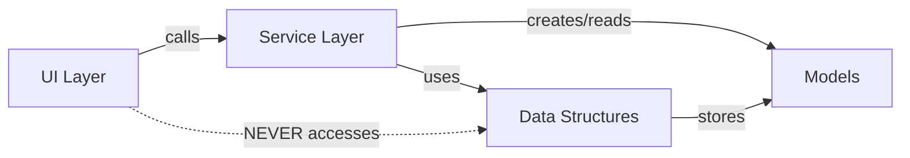

**Rules:**
1. UI layer calls service methods only — never instantiates or accesses data structures directly
2. Service layer orchestrates data structure operations and model creation
3. Data structures are generic — they store model objects but don't depend on specific model types
4. Models are pure data classes with no dependencies on data structures or services

## Components and Interfaces

### Abstract Base Classes

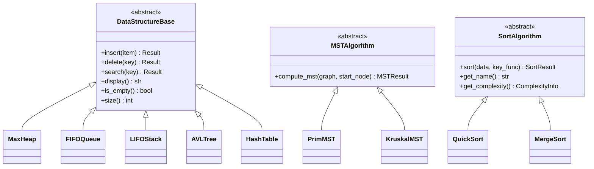

### Core Data Structure Interfaces

```python
from abc import ABC, abstractmethod
from typing import Any, Optional, List
from dataclasses import dataclass

@dataclass
class OperationResult:
    """Standard result object for all data structure operations."""
    success: bool
    message: str
    data: Any = None

class DataStructureBase(ABC):
    """Abstract base class for all linear/tree data structures."""

    @abstractmethod
    def insert(self, item: Any) -> OperationResult:
        """Insert an item into the data structure."""
        pass

    @abstractmethod
    def delete(self, key: Any) -> OperationResult:
        """Delete an item by key from the data structure."""
        pass

    @abstractmethod
    def search(self, key: Any) -> OperationResult:
        """Search for an item by key."""
        pass

    @abstractmethod
    def display(self) -> str:
        """Return a string representation of the structure's contents."""
        pass

    @abstractmethod
    def is_empty(self) -> bool:
        """Check if the structure contains no elements."""
        pass

    @abstractmethod
    def size(self) -> int:
        """Return the number of elements in the structure."""
        pass
```

### MST Algorithm Interface

```python
from abc import ABC, abstractmethod
from dataclasses import dataclass
from typing import List, Tuple

@dataclass
class MSTResult:
    """Result of MST computation."""
    success: bool
    edges: List[Tuple[str, str, int]]  # (source, dest, weight)
    total_cost: int
    message: str

class MSTAlgorithm(ABC):
    """Abstract base class for MST algorithms."""

    @abstractmethod
    def compute_mst(self, graph: 'WeightedGraph', start_node: Optional[str] = None) -> MSTResult:
        """Compute the minimum spanning tree of the given graph."""
        pass

    @abstractmethod
    def get_name(self) -> str:
        """Return the algorithm name."""
        pass
```

### Sorting Algorithm Interface

```python
from abc import ABC, abstractmethod
from dataclasses import dataclass
from typing import List, Callable, Any

@dataclass
class ComplexityInfo:
    """Algorithm complexity information."""
    best_case: str
    average_case: str
    worst_case: str
    space: str

@dataclass
class SortResult:
    """Result of a sort operation with performance metrics."""
    sorted_data: List[Any]
    execution_time_ms: float
    memory_bytes: int
    comparisons: int

class SortAlgorithm(ABC):
    """Abstract base class for sorting algorithms."""

    @abstractmethod
    def sort(self, data: List[Any], key_func: Callable[[Any], float]) -> SortResult:
        """Sort the data using the specified key function."""
        pass

    @abstractmethod
    def get_name(self) -> str:
        """Return the algorithm name."""
        pass

    @abstractmethod
    def get_complexity(self) -> ComplexityInfo:
        """Return complexity information for this algorithm."""
        pass
```

### Subsystem Class Diagram

```mermaid
classDiagram
    class WeightedGraph {
        -_adjacency: Dict[str, List[Tuple[str, int]]]
        -_nodes: Dict[str, Airport]
        +add_node(airport: Airport) OperationResult
        +remove_node(iata_code: str) OperationResult
        +add_edge(src: str, dest: str, weight: int) OperationResult
        +remove_edge(src: str, dest: str) OperationResult
        +get_neighbors(iata_code: str) List[Tuple[str, int]]
        +get_all_nodes() List[str]
        +get_all_edges() List[Tuple[str, str, int]]
        +has_node(iata_code: str) bool
        +has_edge(src: str, dest: str) bool
        +node_count() int
        +edge_count() int
        +display() str
    }

    class MaxHeap {
        -_heap: List[Tuple[int, int, Any]]
        -_sequence: int
        +insert(item: Any) OperationResult
        +extract_max() OperationResult
        +peek() OperationResult
        +is_empty() bool
        +size() int
        +display() str
        -_sift_up(index: int)
        -_sift_down(index: int)
        -_parent(index: int) int
        -_left_child(index: int) int
        -_right_child(index: int) int
    }

    class FIFOQueue {
        -_head: Optional[QueueNode]
        -_tail: Optional[QueueNode]
        -_size: int
        -_members: Set[str]
        +enqueue(item: Any, identifier: str) OperationResult
        +dequeue() OperationResult
        +peek() OperationResult
        +contains(identifier: str) bool
        +is_empty() bool
        +size() int
        +display() str
    }

    class LIFOStack {
        -_items: List[Any]
        +push(item: Any) OperationResult
        +pop() OperationResult
        +peek() OperationResult
        +is_empty() bool
        +size() int
        +display() str
    }

    class AVLTree {
        -_root: Optional[AVLNode]
        -_size: int
        +insert(record: PriceRecord) OperationResult
        +delete(price: float) OperationResult
        +search(price: float) OperationResult
        +range_search(min_price: float, max_price: float) OperationResult
        +in_order_traversal() List[PriceRecord]
        +is_empty() bool
        +size() int
        +display() str
        -_rotate_left(node: AVLNode) AVLNode
        -_rotate_right(node: AVLNode) AVLNode
        -_get_balance(node: AVLNode) int
        -_get_height(node: AVLNode) int
        -_rebalance(node: AVLNode) AVLNode
    }

    class AVLNode {
        +key: float
        +records: List[PriceRecord]
        +left: Optional[AVLNode]
        +right: Optional[AVLNode]
        +height: int
    }

    class HashTable {
        -_buckets: List[List[Tuple[str, Any]]]
        -_capacity: int
        -_size: int
        +insert(key: str, value: Any) OperationResult
        +delete(key: str) OperationResult
        +search(key: str) OperationResult
        +update(key: str, value: Any) OperationResult
        +is_empty() bool
        +size() int
        +display() str
        -_hash(key: str) int
        -_find_in_bucket(bucket_idx: int, key: str) Optional[int]
    }

    class KMPMatcher {
        +search(text: str, pattern: str) List[int]
        +compute_failure_function(pattern: str) List[int]
    }

    class BacktrackingSolver {
        +find_all_paths(graph: WeightedGraph, source: str, destination: str, excluded: Set[str]) List[Path]
        -_backtrack(current: str, destination: str, path: List[str], visited: Set[str], excluded: Set[str], graph: WeightedGraph) List[Path]
    }

    class UnionFind {
        -_parent: Dict[str, str]
        -_rank: Dict[str, int]
        +make_set(item: str)
        +find(item: str) str
        +union(a: str, b: str) bool
    }

    AVLTree --> AVLNode
    KruskalMST --> UnionFind
```

### Service Layer

```mermaid
classDiagram
    class FlightNetworkService {
        -_graph: WeightedGraph
        -_dijkstra: DijkstraSolver
        -_prim: PrimMST
        -_kruskal: KruskalMST
        +add_airport(iata_code: str, name: str, city: str) OperationResult
        +remove_airport(iata_code: str) OperationResult
        +add_route(src: str, dest: str, distance: int) OperationResult
        +remove_route(src: str, dest: str) OperationResult
        +shortest_path(src: str, dest: str) OperationResult
        +compute_mst_prim(start: str) MSTResult
        +compute_mst_kruskal() MSTResult
        +display_network() str
    }

    class PassengerPriorityService {
        -_heap: MaxHeap
        +add_passenger(name: str, priority: str) OperationResult
        +process_next() OperationResult
        +peek_next() OperationResult
        +display_queue() str
    }

    class BoardingGateService {
        -_queue: FIFOQueue
        +add_to_boarding(passenger_id: str, name: str) OperationResult
        +board_next() OperationResult
        +display_queue() str
    }

    class CargoManagementService {
        -_stack: LIFOStack
        +load_cargo(item_id: str, description: str, weight: float) OperationResult
        +unload_cargo() OperationResult
        +peek_top() OperationResult
        +display_stack() str
    }

    class FlightPriceService {
        -_avl_tree: AVLTree
        +add_price(origin: str, destination: str, price: float) OperationResult
        +remove_price(price: float) OperationResult
        +search_price(price: float) OperationResult
        +range_search(min_price: float, max_price: float) OperationResult
        +display_prices() str
    }

    class PassengerRegistryService {
        -_hash_table: HashTable
        +create_record(pnr: str, name: str, flight: str, seat: str) OperationResult
        +search_record(pnr: str) OperationResult
        +update_record(pnr: str, **fields) OperationResult
        +delete_record(pnr: str) OperationResult
        +display_registry() str
    }

    class AnalyticsService {
        -_quicksort: QuickSort
        -_mergesort: MergeSort
        +sort_with_quicksort(data: List, key_func) SortResult
        +sort_with_mergesort(data: List, key_func) SortResult
        +comparison_report(data: List, key_func) str
    }

    class PassengerSearchService {
        -_kmp: KMPMatcher
        -_registry: PassengerRegistryService
        +search_by_name(pattern: str) OperationResult
        +search_by_pnr(pattern: str) OperationResult
        +search_by_flight(pattern: str) OperationResult
    }

    class EmergencyRoutePlannerService {
        -_solver: BacktrackingSolver
        -_graph: WeightedGraph
        +close_airport(iata_code: str) OperationResult
        +reopen_airport(iata_code: str) OperationResult
        +find_alternatives(src: str, dest: str) OperationResult
    }
```

## Data Models

### Domain Model Definitions

```python
from dataclasses import dataclass, field
from typing import Optional
from enum import Enum

class PriorityLevel(Enum):
    """Passenger priority classification."""
    PLATINUM = 4
    GOLD = 3
    SILVER = 2
    ECONOMY = 1

@dataclass
class Airport:
    """Represents an airport node in the flight network."""
    iata_code: str          # Exactly 3 uppercase alpha characters
    name: str               # Full airport name
    city: str               # City where airport is located

    def __post_init__(self):
        if not (len(self.iata_code) == 3 and self.iata_code.isalpha() and self.iata_code.isupper()):
            raise ValueError(f"Invalid IATA code: {self.iata_code}")

@dataclass
class Flight:
    """Represents a flight route (edge) between two airports."""
    origin: str             # Origin IATA code
    destination: str        # Destination IATA code
    distance_km: int        # Distance in kilometers (1 to 99999)

    def __post_init__(self):
        if not (1 <= self.distance_km <= 99999):
            raise ValueError(f"Invalid distance: {self.distance_km}")

@dataclass
class Passenger:
    """Represents a passenger record."""
    pnr: str                # Passenger Name Record (alphanumeric)
    name: str               # Full passenger name
    flight_number: str      # Flight number
    seat: str               # Seat assignment
    priority: PriorityLevel = PriorityLevel.ECONOMY

    def __post_init__(self):
        if not (self.pnr and self.pnr.isalnum()):
            raise ValueError(f"Invalid PNR format: {self.pnr}")

@dataclass
class Cargo:
    """Represents a cargo item."""
    item_id: str            # Unique cargo identifier
    description: str        # Description of cargo contents
    weight_kg: float        # Weight in kilograms
    flight_number: str = "" # Associated flight

@dataclass
class PriceRecord:
    """Represents a flight price record stored in the AVL tree."""
    origin: str             # Origin IATA code
    destination: str        # Destination IATA code
    price: float            # Price value (used as AVL tree key)
    currency: str = "GBP"   # Currency code

@dataclass
class Path:
    """Represents a route through the flight network."""
    nodes: list             # Ordered list of IATA codes
    legs: list              # List of (src, dest, distance) tuples
    total_distance: int     # Sum of all leg distances
    is_shortest: bool = False  # Whether this is the shortest alternative
```

### Entity Relationship Diagram

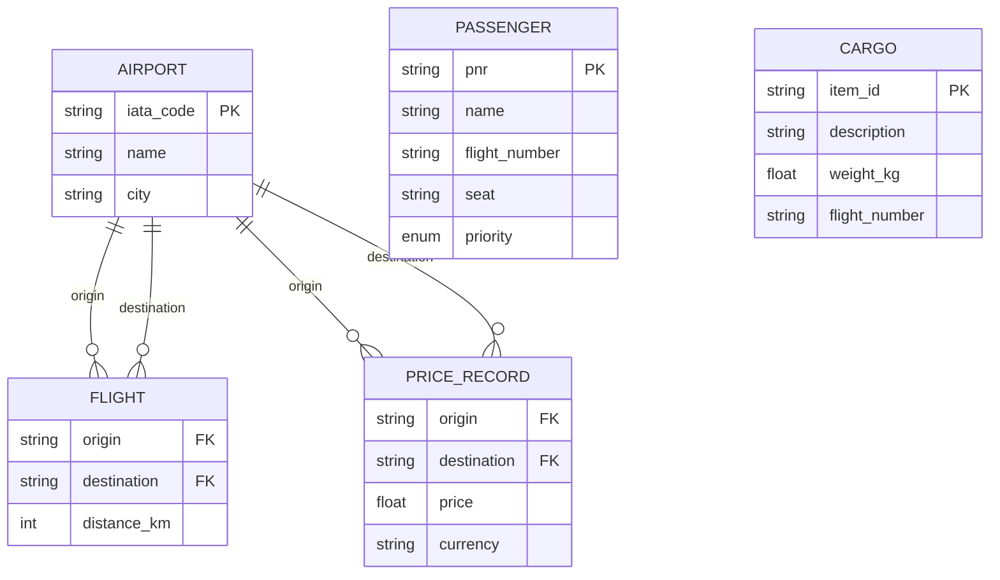

## Key Algorithm Designs

### Dijkstra's Shortest Path

**Pseudocode:**
```
function dijkstra(graph, source, destination):
    dist = {node: INFINITY for all nodes}
    prev = {node: None for all nodes}
    dist[source] = 0
    priority_queue = MinHeap()
    priority_queue.insert((0, source))

    while priority_queue is not empty:
        current_dist, current = priority_queue.extract_min()

        if current == destination:
            break

        if current_dist > dist[current]:
            continue  # Skip outdated entry

        for neighbor, weight in graph.get_neighbors(current):
            new_dist = dist[current] + weight
            if new_dist < dist[neighbor]:
                dist[neighbor] = new_dist
                prev[neighbor] = current
                priority_queue.insert((new_dist, neighbor))

    # Reconstruct path
    path = []
    node = destination
    while node is not None:
        path.prepend(node)
        node = prev[node]

    if dist[destination] == INFINITY:
        return NO_PATH
    return (path, dist[destination])
```

### Prim's MST

**Pseudocode:**
```
function prim_mst(graph, start_node):
    mst_edges = []
    visited = {start_node}
    edge_heap = MinHeap()

    for neighbor, weight in graph.get_neighbors(start_node):
        edge_heap.insert((weight, start_node, neighbor))

    while edge_heap is not empty and len(visited) < graph.node_count():
        weight, src, dest = edge_heap.extract_min()

        if dest in visited:
            continue

        visited.add(dest)
        mst_edges.append((src, dest, weight))

        for neighbor, w in graph.get_neighbors(dest):
            if neighbor not in visited:
                edge_heap.insert((w, dest, neighbor))

    if len(visited) < graph.node_count():
        return DISCONNECTED_ERROR

    return MSTResult(edges=mst_edges, total_cost=sum(w for _, _, w in mst_edges))
```

### Kruskal's MST with Union-Find

**Pseudocode:**
```
function kruskal_mst(graph):
    edges = graph.get_all_edges()  # List of (src, dest, weight)
    edges.sort(by=weight)          # Sort by weight ascending

    uf = UnionFind()
    for node in graph.get_all_nodes():
        uf.make_set(node)

    mst_edges = []
    for src, dest, weight in edges:
        if uf.find(src) != uf.find(dest):
            uf.union(src, dest)
            mst_edges.append((src, dest, weight))

        if len(mst_edges) == graph.node_count() - 1:
            break

    if len(mst_edges) < graph.node_count() - 1:
        return DISCONNECTED_ERROR

    return MSTResult(edges=mst_edges, total_cost=sum(w for _, _, w in mst_edges))
```

### Union-Find with Path Compression and Union by Rank

```
class UnionFind:
    function make_set(x):
        parent[x] = x
        rank[x] = 0

    function find(x):
        if parent[x] != x:
            parent[x] = find(parent[x])  # Path compression
        return parent[x]

    function union(a, b):
        root_a = find(a)
        root_b = find(b)
        if root_a == root_b:
            return False  # Already in same set
        if rank[root_a] < rank[root_b]:
            parent[root_a] = root_b
        elif rank[root_a] > rank[root_b]:
            parent[root_b] = root_a
        else:
            parent[root_b] = root_a
            rank[root_a] += 1
        return True
```

### Max-Heap with Stable Priority Ordering

**Pseudocode:**
```
class MaxHeap:
    # Each element stored as (priority_value, -sequence_number, item)
    # Negative sequence ensures FIFO within same priority (larger sequence = more recent = lower)

    function insert(item, priority):
        self._sequence += 1
        entry = (priority, -self._sequence, item)
        self._heap.append(entry)
        self._sift_up(len(self._heap) - 1)

    function extract_max():
        if is_empty(): return ERROR
        max_item = self._heap[0]
        last = self._heap.pop()
        if not is_empty():
            self._heap[0] = last
            self._sift_down(0)
        return max_item[2]  # Return the item

    function _sift_up(index):
        while index > 0:
            parent = (index - 1) // 2
            if self._heap[index] > self._heap[parent]:
                swap(self._heap[index], self._heap[parent])
                index = parent
            else:
                break

    function _sift_down(index):
        while True:
            largest = index
            left = 2 * index + 1
            right = 2 * index + 2
            if left < len(self._heap) and self._heap[left] > self._heap[largest]:
                largest = left
            if right < len(self._heap) and self._heap[right] > self._heap[largest]:
                largest = right
            if largest == index:
                break
            swap(self._heap[index], self._heap[largest])
            index = largest
```

### AVL Tree Rotations

**Pseudocode:**
```
function rotate_right(y):
    x = y.left
    T2 = x.right
    x.right = y
    y.left = T2
    y.height = 1 + max(height(y.left), height(y.right))
    x.height = 1 + max(height(x.left), height(x.right))
    return x  # New root

function rotate_left(x):
    y = x.right
    T2 = y.left
    y.left = x
    x.right = T2
    x.height = 1 + max(height(x.left), height(x.right))
    y.height = 1 + max(height(y.left), height(y.right))
    return y  # New root

function rebalance(node):
    balance = get_balance(node)  # height(left) - height(right)

    # Left-Left (LL) case
    if balance > 1 and get_balance(node.left) >= 0:
        return rotate_right(node)

    # Left-Right (LR) case
    if balance > 1 and get_balance(node.left) < 0:
        node.left = rotate_left(node.left)
        return rotate_right(node)

    # Right-Right (RR) case
    if balance < -1 and get_balance(node.right) <= 0:
        return rotate_left(node)

    # Right-Left (RL) case
    if balance < -1 and get_balance(node.right) > 0:
        node.right = rotate_right(node.right)
        return rotate_left(node)

    return node
```

### QuickSort (Last-Element Pivot)

**Pseudocode:**
```
function quicksort(arr, low, high, key_func):
    if low < high:
        pivot_index = partition(arr, low, high, key_func)
        quicksort(arr, low, pivot_index - 1, key_func)
        quicksort(arr, pivot_index + 1, high, key_func)

function partition(arr, low, high, key_func):
    pivot = key_func(arr[high])  # Last element as pivot
    i = low - 1

    for j in range(low, high):
        if key_func(arr[j]) <= pivot:
            i += 1
            swap(arr[i], arr[j])

    swap(arr[i + 1], arr[high])
    return i + 1
```

### MergeSort (Divide-and-Conquer)

**Pseudocode:**
```
function mergesort(arr, key_func):
    if len(arr) <= 1:
        return arr

    mid = len(arr) // 2
    left = mergesort(arr[:mid], key_func)
    right = mergesort(arr[mid:], key_func)
    return merge(left, right, key_func)

function merge(left, right, key_func):
    result = []
    i, j = 0, 0

    while i < len(left) and j < len(right):
        if key_func(left[i]) <= key_func(right[j]):
            result.append(left[i])
            i += 1
        else:
            result.append(right[j])
            j += 1

    result.extend(left[i:])
    result.extend(right[j:])
    return result
```

### KMP String Matching

**Pseudocode:**
```
function compute_failure_function(pattern):
    m = len(pattern)
    failure = [0] * m
    j = 0

    for i in range(1, m):
        while j > 0 and pattern[i] != pattern[j]:
            j = failure[j - 1]
        if pattern[i] == pattern[j]:
            j += 1
        failure[i] = j

    return failure

function kmp_search(text, pattern):
    n = len(text)
    m = len(pattern)
    failure = compute_failure_function(pattern)
    matches = []
    j = 0

    for i in range(n):
        while j > 0 and text[i] != pattern[j]:
            j = failure[j - 1]
        if text[i] == pattern[j]:
            j += 1
        if j == m:
            matches.append(i - m + 1)  # Match found at index
            j = failure[j - 1]

    return matches
```

### Recursive Backtracking Route Finder

**Pseudocode:**
```
function find_all_paths(graph, source, destination, excluded_nodes):
    all_paths = []
    visited = set()
    visited.add(source)
    _backtrack(graph, source, destination, [source], visited, excluded_nodes, all_paths)
    return all_paths

function _backtrack(graph, current, destination, path, visited, excluded, all_paths):
    if current == destination:
        all_paths.append(copy(path))
        return

    for neighbor, weight in graph.get_neighbors(current):
        if neighbor not in visited and neighbor not in excluded:
            visited.add(neighbor)
            path.append(neighbor)
            _backtrack(graph, neighbor, destination, path, visited, excluded, all_paths)
            path.pop()
            visited.remove(neighbor)
```

### Hash Function Design

```
function hash(key: str, capacity: int) -> int:
    """
    Polynomial rolling hash function.
    Uses prime multiplier 31 for good distribution of alphanumeric keys.
    """
    hash_value = 0
    prime = 31
    for char in key:
        hash_value = (hash_value * prime + ord(char)) % capacity
    return hash_value
```

## Sequence Diagrams

### Shortest Path Query Flow

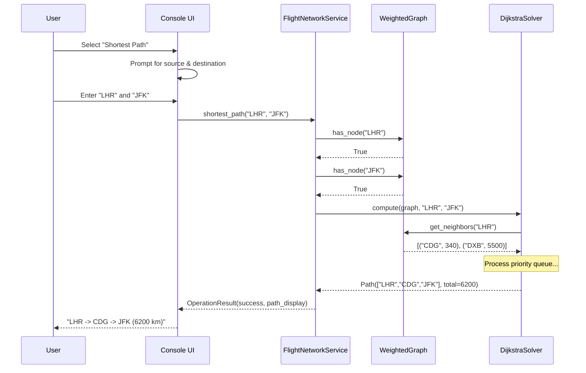

### MST Computation Flow

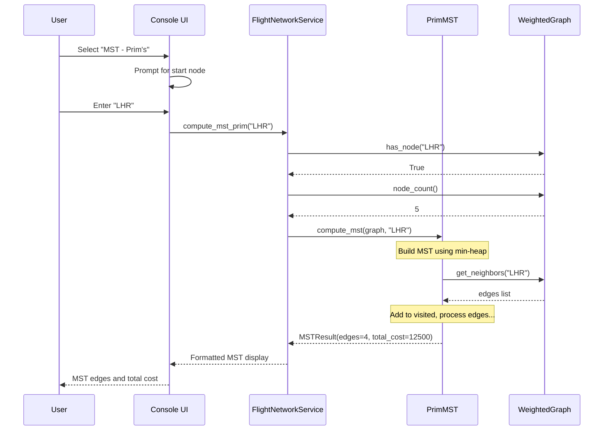

### Passenger Priority Flow

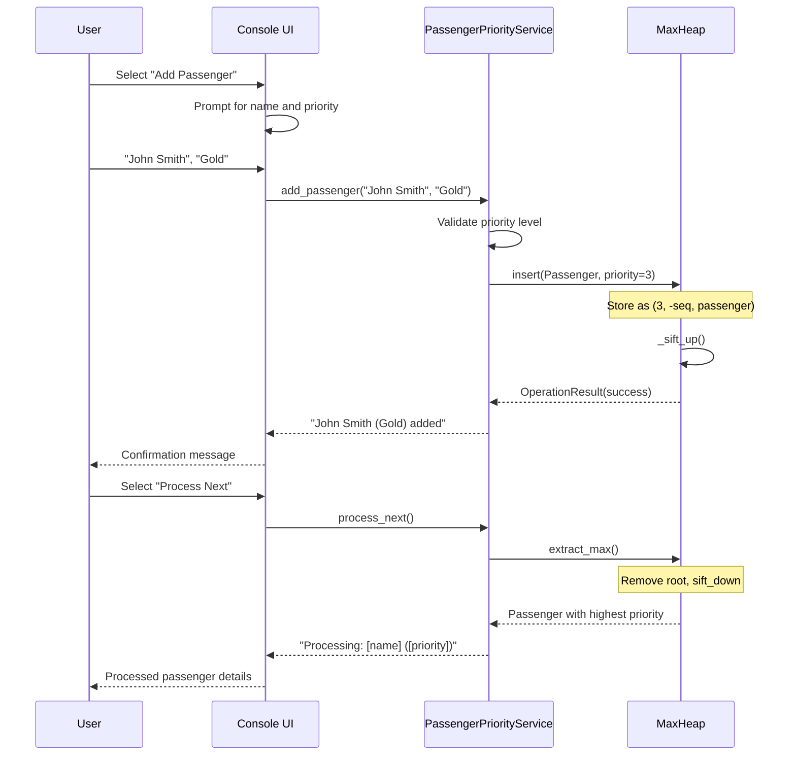

### Emergency Route Planning Flow

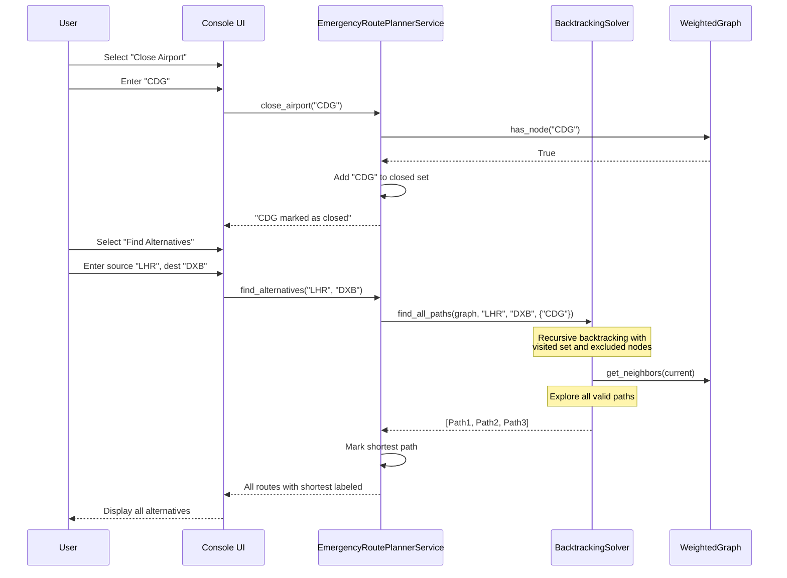

## Correctness Properties

*A property is a characteristic or behavior that should hold true across all valid executions of a system — essentially, a formal statement about what the system should do. Properties serve as the bridge between human-readable specifications and machine-verifiable correctness guarantees.*

### Property 1: Graph Node Addition Idempotence

*For any* valid 3-character uppercase alphabetic IATA code, adding it to the graph once should succeed and adding it a second time should be rejected, with the graph size remaining unchanged after the second attempt.

**Validates: Requirements 1.1, 1.2**

### Property 2: Graph Edge Bidirectionality

*For any* two existing airport nodes and any valid weight (1-99999), after adding an edge between them, querying neighbors of either node should include the other node with the specified weight.

**Validates: Requirements 1.3**

### Property 3: Node Deletion Cascades to Edges

*For any* airport node in the graph, after deleting that node, no other node's adjacency list should reference the deleted node.

**Validates: Requirements 1.5**

### Property 4: Edge Deletion Preserves Nodes

*For any* existing edge between two airports, after removing the edge, both airport nodes should still exist in the graph but querying neighbors should no longer show the connection.

**Validates: Requirements 1.7**

### Property 5: Dijkstra's Shortest Path Correctness

*For any* connected weighted graph and any two connected nodes, the path returned by Dijkstra's algorithm should have a total weight less than or equal to every other valid path between those same two nodes.

**Validates: Requirements 2.1**

### Property 6: MST Algorithm Confluence

*For any* connected weighted graph, the total cost produced by Prim's algorithm should equal the total cost produced by Kruskal's algorithm.

**Validates: Requirements 3.4**

### Property 7: MST Structural Validity

*For any* connected graph with V nodes, both Prim's and Kruskal's algorithms should produce exactly V-1 edges that connect all nodes (form a spanning tree).

**Validates: Requirements 3.1, 3.2**

### Property 8: Heap Extraction Priority Ordering

*For any* sequence of passengers with various valid priority levels inserted into the max-heap, successive extract operations should return passengers in non-increasing priority order, with FIFO ordering among equal priorities.

**Validates: Requirements 4.1, 4.2, 4.3**

### Property 9: Heap Peek Idempotence

*For any* non-empty max-heap, calling peek should return the same value that extract_max would return, without changing the heap's size or contents.

**Validates: Requirements 4.4**

### Property 10: Heap Structural Invariant

*For any* sequence of insert and extract operations on a max-heap, after every operation, all parent nodes should have priority values greater than or equal to their children.

**Validates: Requirements 4.6**

### Property 11: Queue FIFO Ordering

*For any* sequence of N distinct passengers enqueued into the boarding gate queue, dequeuing all N passengers should return them in exactly the same order they were enqueued.

**Validates: Requirements 5.1, 5.2, 5.5**

### Property 12: Queue Duplicate Rejection

*For any* passenger already in the boarding queue, attempting to enqueue them again should fail and the queue size should remain unchanged.

**Validates: Requirements 5.7**

### Property 13: Stack LIFO Ordering

*For any* sequence of N cargo items pushed onto the stack, popping all N items should return them in reverse insertion order.

**Validates: Requirements 6.1, 6.2, 6.8**

### Property 14: Stack Peek Non-Destructive

*For any* non-empty stack, calling peek should return the same value that pop would return, without changing the stack's size.

**Validates: Requirements 6.6**

### Property 15: AVL Balance Invariant

*For any* sequence of insertions and deletions on the AVL tree, after every operation, every node should satisfy the property that the absolute difference between the height of its left subtree and right subtree is at most 1.

**Validates: Requirements 7.1, 7.2, 7.8**

### Property 16: AVL In-Order Traversal Produces Sorted Output

*For any* AVL tree containing price records, in-order traversal should produce records in non-decreasing price order.

**Validates: Requirements 7.6**

### Property 17: AVL Range Search Completeness and Soundness

*For any* AVL tree and any valid range [min, max], the range search should return exactly the set of records whose price falls within [min, max] — no more, no less.

**Validates: Requirements 7.5**

### Property 18: Hash Table Insert-Lookup Round Trip

*For any* valid PNR and associated passenger record, after inserting the record, searching by the same PNR should return the stored record with all fields intact.

**Validates: Requirements 8.1, 8.2, 8.7**

### Property 19: Hash Table Delete Then Search Fails

*For any* PNR that exists in the hash table, after deletion, searching for that PNR should report not found.

**Validates: Requirements 8.4**

### Property 20: Hash Table Duplicate PNR Rejection

*For any* PNR already stored in the hash table, attempting to insert a new record with the same PNR should be rejected and the existing record should remain unchanged.

**Validates: Requirements 8.5**

### Property 21: Sorting Correctness — Output is Sorted

*For any* input list of numeric records (size 0 to 10,000), both QuickSort and MergeSort should produce output where element[i] <= element[i+1] for all consecutive pairs.

**Validates: Requirements 9.1, 9.2, 9.6**

### Property 22: Sorting Algorithms Produce Identical Output

*For any* input list, the output of QuickSort should be element-by-element identical to the output of MergeSort.

**Validates: Requirements 9.5**

### Property 23: Sorting Preserves Elements (Permutation Property)

*For any* input list, the sorted output should be a permutation of the input — same elements, same count of each element, just reordered.

**Validates: Requirements 9.1, 9.2**

### Property 24: KMP Search Matches Model

*For any* text string and pattern string (both case-insensitively compared), the set of match positions returned by KMP should be identical to the set of positions found by a naive brute-force substring search.

**Validates: Requirements 10.2, 10.3, 10.4**

### Property 25: KMP Failure Function Correctness

*For any* pattern string of length 1-50, the failure function value at position i should equal the length of the longest proper prefix of pattern[0..i] that is also a suffix of pattern[0..i].

**Validates: Requirements 10.1**

### Property 26: Backtracking Paths Exclude Closed Nodes

*For any* graph, closed airport, source, and destination, every path returned by the backtracking solver should not contain the closed airport node.

**Validates: Requirements 11.2**

### Property 27: Backtracking Paths Are Acyclic

*For any* path returned by the backtracking solver, all nodes in the path should be unique (no node appears more than once).

**Validates: Requirements 11.6**

### Property 28: Backtracking Paths Are Valid

*For any* path returned by the backtracking solver, each consecutive pair of nodes in the path should have a corresponding edge in the graph.

**Validates: Requirements 11.2, 11.3**

### Property 29: Backtracking Shortest Label Correctness

*For any* set of alternative routes returned by the emergency planner, the route labeled as "shortest" should have a total distance less than or equal to all other routes in the set.

**Validates: Requirements 11.4**

### Property 30: Backtracking Distance Consistency

*For any* route returned by the emergency planner, the reported total distance should equal the sum of the individual leg distances.

**Validates: Requirements 11.3**

## Error Handling

### Error Handling Strategy

The system uses a consistent `OperationResult` pattern across all subsystems:

| Error Category | Handling Approach | Example |
|---|---|---|
| Invalid IATA Code | Validate format before operation; return descriptive error | "Invalid IATA code: 'AB' — must be exactly 3 uppercase letters" |
| Duplicate Entry | Check existence before insert; return rejection | "Airport LHR already exists in the network" |
| Not Found | Check existence before operation; return not-found message | "PNR 'XYZ123' not found in registry" |
| Empty Structure | Check `is_empty()` before extract/peek; return empty message | "No passengers in the boarding queue" |
| Invalid Priority | Validate against PriorityLevel enum; return valid options | "Invalid priority 'Diamond'. Valid: Platinum, Gold, Silver, Economy" |
| Invalid Weight/Price | Validate numeric range; return bounds | "Distance must be between 1 and 99999 km" |
| Disconnected Graph | Detect during MST; report components | "Graph is disconnected. Components: {LHR,CDG}, {JFK,LAX}" |
| Invalid PNR Format | Validate alphanumeric non-empty; return format rules | "PNR must be non-empty and contain only letters and digits" |
| Empty/Whitespace Pattern | Validate non-empty non-whitespace; return requirement | "Search pattern must contain at least one non-whitespace character" |

### Input Validation Layer

All validation occurs at the service layer boundary. The UI layer performs basic type checking (numeric vs string), while the service layer validates business rules. Data structures assume valid inputs and never perform validation themselves.

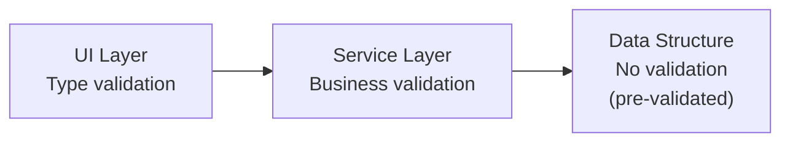

### Exception Safety

- Data structures never raise exceptions during normal operation; they return `OperationResult` with `success=False`
- Model constructors (`__post_init__`) raise `ValueError` for invalid construction — caught at service layer
- The UI layer catches all exceptions and displays user-friendly messages
- No operation leaves a data structure in an inconsistent state (operations are atomic)

## Testing Strategy

### Testing Architecture

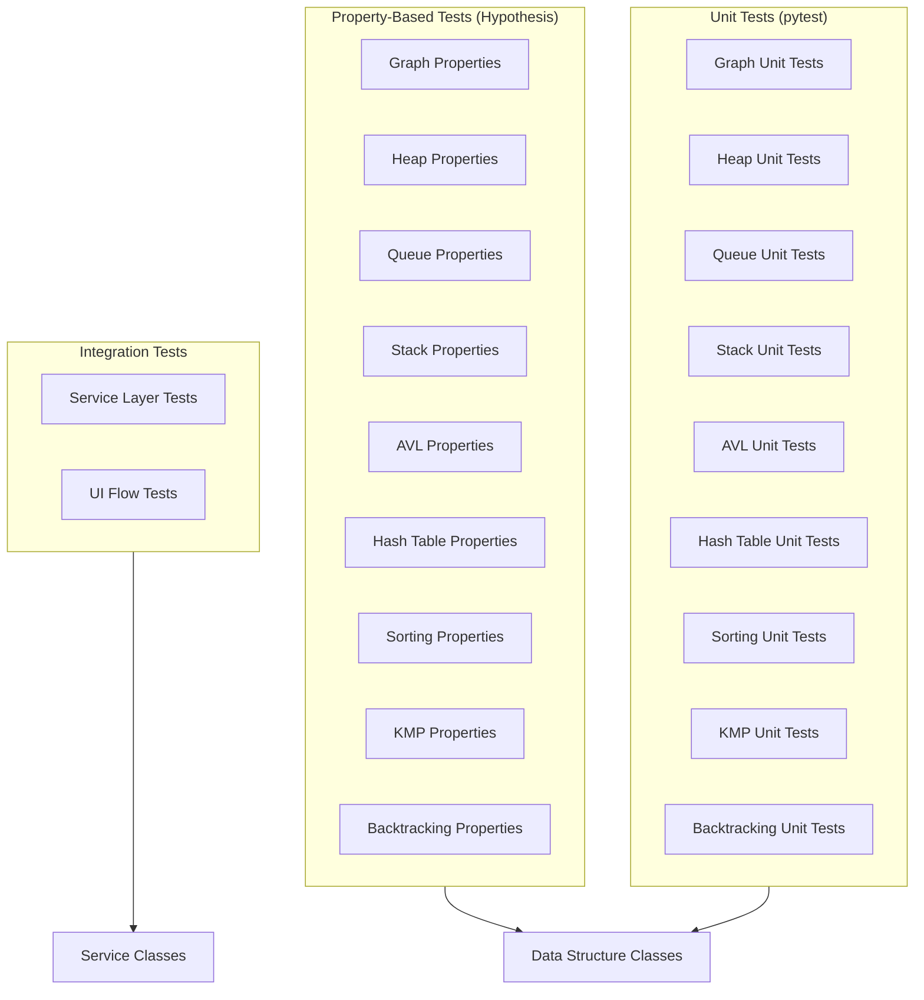

### Test Organization

```
tests/
├── conftest.py                  # Shared fixtures and generators
├── property_tests/
│   ├── test_graph_properties.py
│   ├── test_heap_properties.py
│   ├── test_queue_properties.py
│   ├── test_stack_properties.py
│   ├── test_avl_properties.py
│   ├── test_hash_table_properties.py
│   ├── test_sorting_properties.py
│   ├── test_kmp_properties.py
│   └── test_backtracking_properties.py
├── unit_tests/
│   ├── test_graph.py
│   ├── test_heap.py
│   ├── test_queue.py
│   ├── test_stack.py
│   ├── test_avl.py
│   ├── test_hash_table.py
│   ├── test_sorting.py
│   ├── test_kmp.py
│   └── test_backtracking.py
├── integration_tests/
│   ├── test_flight_network_service.py
│   ├── test_passenger_priority_service.py
│   ├── test_boarding_gate_service.py
│   ├── test_cargo_management_service.py
│   ├── test_flight_price_service.py
│   ├── test_passenger_registry_service.py
│   ├── test_analytics_service.py
│   ├── test_passenger_search_service.py
│   └── test_emergency_route_planner_service.py
└── test_report_generator.py     # Generates testing report
```

### Property-Based Testing Configuration

- **Library**: [Hypothesis](https://hypothesis.readthedocs.io/) — Python's standard PBT library
- **Minimum iterations**: 100 per property test (via `@settings(max_examples=100)`)
- **Tag format**: Each test annotated with comment `# Feature: skynet-aviation-logistics, Property N: [property text]`

**Example property test structure:**
```python
from hypothesis import given, settings, strategies as st

# Feature: skynet-aviation-logistics, Property 13: Stack LIFO Ordering
@settings(max_examples=100)
@given(items=st.lists(st.text(min_size=1), min_size=1, max_size=50))
def test_stack_lifo_ordering(items):
    """For any sequence of items pushed, popping all returns them in reverse order."""
    stack = LIFOStack()
    for item in items:
        stack.push(Cargo(item_id=item, description=item, weight_kg=1.0))
    
    popped = []
    while not stack.is_empty():
        result = stack.pop()
        popped.append(result.data.item_id)
    
    assert popped == list(reversed(items))
```

### Unit Test Categories Per Subsystem

Each subsystem requires at least 3 unit tests covering:

1. **Normal Operation** — Valid inputs produce correct outputs
2. **Edge Cases** — Empty structures, single elements, boundary values
3. **Error Conditions** — Invalid inputs, duplicate entries, not-found scenarios

### Test Report Generation

The test runner generates a report containing:
- Total tests executed
- Tests passed / failed
- Pass rate by subsystem
- Property test iteration counts
- Coverage summary

### Documentation Generation Approach

The project includes a `docs/` generator that produces Markdown-formatted academic documentation:

```
docs/
├── generate_docs.py            # Documentation generator script
├── templates/
│   ├── algorithm_template.md   # Template for algorithm explanations
│   ├── complexity_template.md  # Template for complexity analysis
│   └── flowchart_template.md   # Template for Mermaid flowcharts
└── output/
    ├── pass_criteria.md        # P1-P7 documentation
    ├── merit_criteria.md       # M1-M5 documentation
    ├── distinction_criteria.md # D1-D4 documentation
    └── full_report.md          # Combined academic report
```

**Generation Strategy:**
- Each algorithm class includes docstrings with: purpose, step-by-step operation, complexity analysis
- The generator introspects classes and extracts structured documentation
- Flowcharts are generated as Mermaid diagrams embedded in the output
- Performance data is collected from actual test runs (3 dataset sizes: 100, 1000, 10000 records)
- The generator maps each class/algorithm to the grading criteria it satisfies

**Grading Criteria Coverage:**
| Criterion | Covered By |
|---|---|
| P1-P7 | ADT specifications with pseudocode for all structures |
| M1-M3 | Step-by-step walkthroughs with state diagrams |
| M4-M5 | Time/space complexity analysis with justification |
| D1-D2 | Comparative efficiency analysis (AVL vs Hash, Graph algorithms) |
| D3-D4 | Empirical performance measurement with multiple dataset sizes |
