# Algorithm Analysis — SkyNet Aviation Logistics

## Overview

This document provides comprehensive analysis of every algorithm implemented in SkyNet, including explanations, Mermaid flowcharts, complexity analysis, and step-by-step walkthroughs with sample data.

---

## 1. Dijkstra's Shortest Path Algorithm

### Explanation
Dijkstra's algorithm finds the shortest path between a source node and all other nodes in a weighted graph with non-negative edge weights. It uses a greedy approach, always expanding the unvisited node with the smallest known distance. A priority queue (min-heap) efficiently selects the next node to process.

**Aviation Application**: Finding the shortest flight route (by distance) between any two airports in the SkyNet network.

### Flowchart

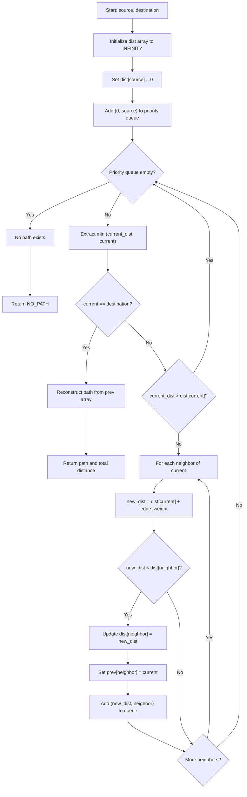

### Time Complexity
| Case | Complexity | Justification |
|------|-----------|---------------|
| **Best** | O((V+E) log V) | Must visit all vertices; each heap operation is O(log V) |
| **Average** | O((V+E) log V) | Each vertex extracted once, each edge relaxed once |
| **Worst** | O((V+E) log V) | With binary heap; O(V²) with simple array |

### Space Complexity
- **O(V)** — distance array, predecessor array, priority queue (at most V entries active)

### Step-by-Step Walkthrough

**Sample Network:**
```
LHR --340--> CDG --500--> JFK
LHR --5500--> DXB --800--> JFK
LHR --7000--> JFK (direct)
```

**Find shortest path: LHR → JFK**

| Step | Extract | Process | dist[LHR] | dist[CDG] | dist[DXB] | dist[JFK] | Queue |
|------|---------|---------|-----------|-----------|-----------|-----------|-------|
| 0 | — | Init | 0 | ∞ | ∞ | ∞ | [(0,LHR)] |
| 1 | (0,LHR) | Neighbors: CDG(340), DXB(5500), JFK(7000) | 0 | 340 | 5500 | 7000 | [(340,CDG),(5500,DXB),(7000,JFK)] |
| 2 | (340,CDG) | Neighbors: JFK(500) → 340+500=840 < 7000 | 0 | 340 | 5500 | 840 | [(840,JFK),(5500,DXB),(7000,JFK*)] |
| 3 | (840,JFK) | Destination reached! | 0 | 340 | 5500 | 840 | — |

**Result**: LHR → CDG → JFK, Total Distance = 840 km  
**Path reconstruction**: prev[JFK]=CDG, prev[CDG]=LHR → Path: [LHR, CDG, JFK]

---

## 2. Prim's Minimum Spanning Tree

### Explanation
Prim's algorithm builds a minimum spanning tree by growing a single tree from a starting node. At each step, it selects the minimum-weight edge that connects a visited node to an unvisited node. Uses a min-heap to efficiently find the next minimum edge.

**Aviation Application**: Finding the cheapest subset of routes that connects all airports — useful for establishing minimum-cost air service coverage.

### Flowchart

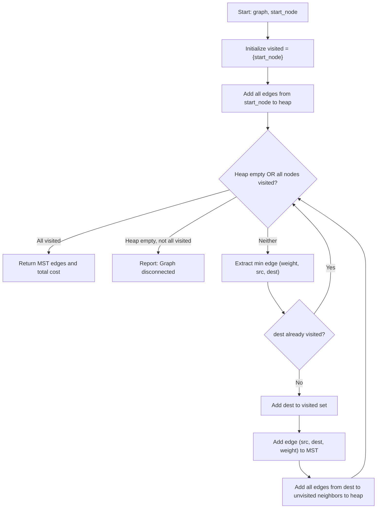

### Time Complexity
| Case | Complexity | Justification |
|------|-----------|---------------|
| **Best** | O(E log V) | Each edge considered once; heap operations O(log V) |
| **Average** | O(E log V) | E insertions/extractions from heap |
| **Worst** | O(E log V) | Dense graph: E ≈ V², so O(V² log V) |

### Space Complexity
- **O(V + E)** — visited set (V) + edge heap (up to E entries)

### Step-by-Step Walkthrough

**Sample Network:**
```
LHR --340-- CDG
LHR --5500-- DXB
CDG --500-- JFK
CDG --4800-- DXB
DXB --800-- JFK
```

**Prim's MST starting from LHR:**

| Step | Extract | Action | Visited | MST Edges | Heap |
|------|---------|--------|---------|-----------|------|
| 0 | — | Start at LHR | {LHR} | [] | [(340,LHR,CDG),(5500,LHR,DXB)] |
| 1 | (340,LHR,CDG) | Add CDG | {LHR,CDG} | [(LHR,CDG,340)] | [(500,CDG,JFK),(4800,CDG,DXB),(5500,LHR,DXB)] |
| 2 | (500,CDG,JFK) | Add JFK | {LHR,CDG,JFK} | [(LHR,CDG,340),(CDG,JFK,500)] | [(800,JFK,DXB),(4800,CDG,DXB),(5500,LHR,DXB)] |
| 3 | (800,JFK,DXB) | Add DXB | {LHR,CDG,JFK,DXB} | [(LHR,CDG,340),(CDG,JFK,500),(JFK,DXB,800)] | — |

**Result**: MST edges = {LHR-CDG(340), CDG-JFK(500), JFK-DXB(800)}, Total cost = 1640

---

## 3. Kruskal's Minimum Spanning Tree

### Explanation
Kruskal's algorithm builds a minimum spanning tree by sorting all edges by weight and greedily adding the cheapest edge that doesn't create a cycle. Uses Union-Find to efficiently detect whether an edge would form a cycle.

**Aviation Application**: Same as Prim's — finding minimum-cost route coverage. Kruskal's is preferred when the graph is sparse (fewer routes relative to airports).

### Flowchart

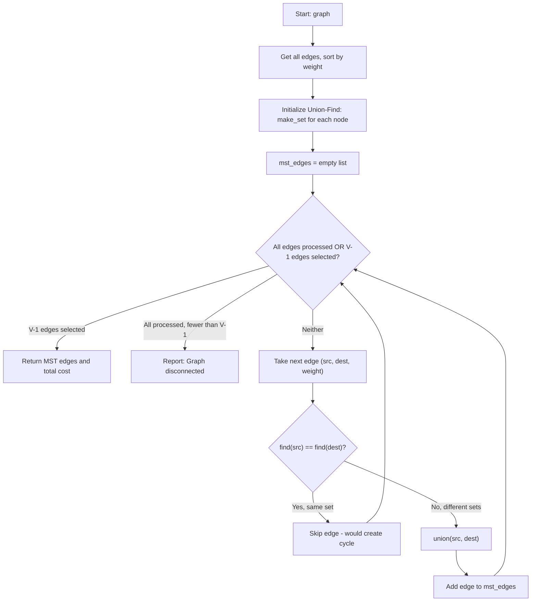

### Time Complexity
| Case | Complexity | Justification |
|------|-----------|---------------|
| **Best** | O(E log E) | Dominated by sorting E edges |
| **Average** | O(E log E) | Sort + E union-find operations (nearly constant each) |
| **Worst** | O(E log E) | Equivalent to O(E log V) since E ≤ V² → log E ≤ 2 log V |

### Space Complexity
- **O(V + E)** — edge list (E) + Union-Find parent/rank arrays (V each)

### Step-by-Step Walkthrough

**Same sample network, all edges sorted by weight:**

| Edge | Weight | Action | Union-Find Sets |
|------|--------|--------|----------------|
| LHR-CDG | 340 | find(LHR)≠find(CDG) → ADD | {LHR,CDG}, {DXB}, {JFK} |
| CDG-JFK | 500 | find(CDG)≠find(JFK) → ADD | {LHR,CDG,JFK}, {DXB} |
| DXB-JFK | 800 | find(DXB)≠find(JFK) → ADD | {LHR,CDG,JFK,DXB} |
| CDG-DXB | 4800 | find(CDG)==find(DXB) → SKIP | — |
| LHR-DXB | 5500 | find(LHR)==find(DXB) → SKIP | — |

**Result**: MST edges = {LHR-CDG(340), CDG-JFK(500), DXB-JFK(800)}, Total cost = 1640  
**Note**: Same total cost as Prim's (Property 6: MST Algorithm Confluence)

---

## 4. Max-Heap Operations (Insert / Extract-Max)

### Explanation

**Insert (Sift-Up)**: Place new element at end of array, then repeatedly swap with parent until heap property is restored (parent ≥ child).

**Extract-Max (Sift-Down)**: Remove root (maximum), replace with last element, then repeatedly swap with larger child until heap property is restored.

**Aviation Application**: Processing passengers in priority order — Platinum passengers are served before Gold, who are served before Silver, etc.

### Flowchart — Insert (Sift-Up)

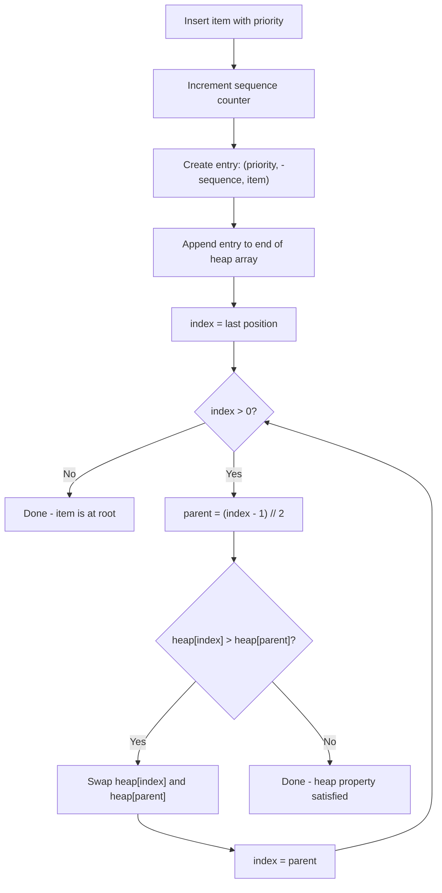

### Flowchart — Extract-Max (Sift-Down)

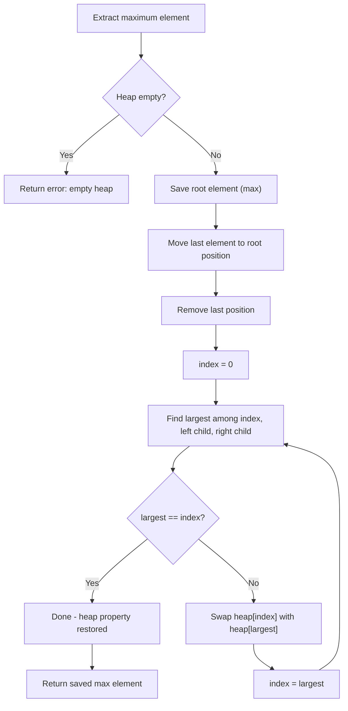

### Time Complexity
| Operation | Best | Average | Worst | Justification |
|-----------|------|---------|-------|---------------|
| **Insert** | O(1) | O(log n) | O(log n) | Best: item belongs at leaf; Worst: bubbles to root |
| **Extract-Max** | O(log n) | O(log n) | O(log n) | Always sifts from root to leaf (height = log n) |
| **Peek** | O(1) | O(1) | O(1) | Direct array access at index 0 |

### Space Complexity
- **O(n)** — array of n elements, no additional structures needed

### Step-by-Step Walkthrough

**Insert sequence: Alice(Gold=3), Bob(Platinum=4), Carol(Silver=2), Dave(Gold=3)**

| Step | Action | Heap Array (priority, -seq, name) | Tree State |
|------|--------|-----------------------------------|------------|
| 1 | Insert Alice(3) | [(3,-1,Alice)] | Root: Alice(3) |
| 2 | Insert Bob(4) | [(4,-2,Bob),(3,-1,Alice)] | Root: Bob(4), Left: Alice(3) |
| 3 | Insert Carol(2) | [(4,-2,Bob),(3,-1,Alice),(2,-3,Carol)] | Root: Bob(4) |
| 4 | Insert Dave(3) | [(4,-2,Bob),(3,-1,Alice),(2,-3,Carol),(3,-4,Dave)] | Root: Bob(4) |

**Extract sequence:**
| Step | Extracted | Remaining Heap |
|------|-----------|----------------|
| 1 | Bob (Platinum, seq=2) | [(3,-1,Alice),(3,-4,Dave),(2,-3,Carol)] |
| 2 | Alice (Gold, seq=1) — earlier than Dave | [(3,-4,Dave),(2,-3,Carol)] |
| 3 | Dave (Gold, seq=4) | [(2,-3,Carol)] |
| 4 | Carol (Silver, seq=3) | [] |

---

## 5. AVL Tree Rotations

### Explanation
AVL rotations are restructuring operations that restore the balance property (|height(left) - height(right)| ≤ 1) after insertions or deletions. There are four cases:

1. **Left-Left (LL)**: Left child is left-heavy → single right rotation
2. **Left-Right (LR)**: Left child is right-heavy → left rotation on child, then right rotation
3. **Right-Right (RR)**: Right child is right-heavy → single left rotation
4. **Right-Left (RL)**: Right child is left-heavy → right rotation on child, then left rotation

**Aviation Application**: Maintaining balanced flight price database for guaranteed O(log n) lookups even with frequent price updates.

### Flowchart — Rebalancing

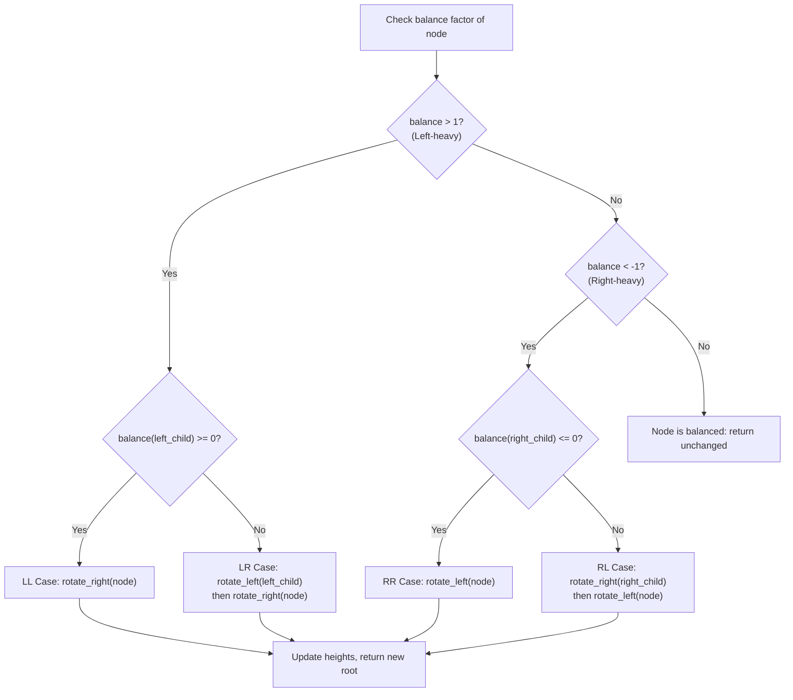

### Time Complexity
| Operation | Best | Average | Worst | Justification |
|-----------|------|---------|-------|---------------|
| **Insert** | O(log n) | O(log n) | O(log n) | Traverse height + at most 2 rotations |
| **Delete** | O(log n) | O(log n) | O(log n) | Traverse + up to O(log n) rotations on path back |
| **Search** | O(log n) | O(log n) | O(log n) | Height bounded by 1.44 log₂(n+2) |
| **Rotation** | O(1) | O(1) | O(1) | Constant pointer reassignment + height update |

### Space Complexity
- **O(n)** — n nodes, each with constant overhead (height, two child pointers)

### Step-by-Step Walkthrough — LL Case

**Insert prices: 500, 300, 100 (triggers LL rotation)**

```
Before rotation:        After rotation:
    500 (bf=2)              300 (bf=0)
   /                       /   \
  300 (bf=1)             100    500
 /
100
```

**Steps:**
1. Insert 500 → root
2. Insert 300 → left of 500; balance(500) = 1 (OK)
3. Insert 100 → left of 300; balance(500) = 2 (VIOLATION!)
4. Left child (300) has balance ≥ 0 → **LL case**
5. Right-rotate(500): 300 becomes root, 500 becomes right child of 300
6. Result: balanced tree with height 1

---

## 6. QuickSort (Last-Element Pivot)

### Explanation
QuickSort is a divide-and-conquer algorithm that selects a pivot element (last element in this implementation), partitions the array such that all elements ≤ pivot are on the left and all elements > pivot are on the right, then recursively sorts both partitions.

**Aviation Application**: Sorting flight data, passenger lists, and price records for analytics and reporting.

### Flowchart

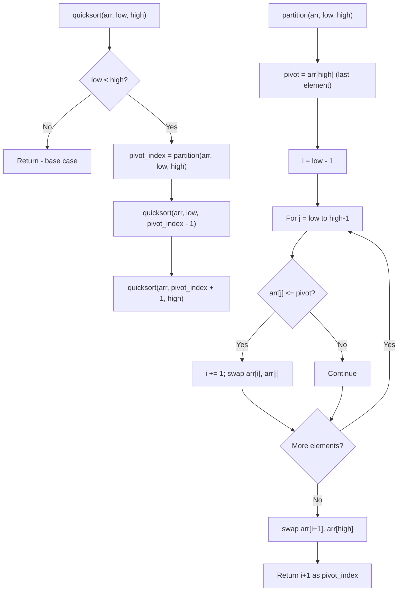

### Time Complexity
| Case | Complexity | Justification |
|------|-----------|---------------|
| **Best** | O(n log n) | Pivot always splits array in half → log n levels, n work per level |
| **Average** | O(n log n) | Expected partition ratio is balanced on average |
| **Worst** | O(n²) | Already sorted array with last-element pivot → n levels of n work |

### Space Complexity
- **O(log n)** average — recursion stack depth (balanced partitions)
- **O(n)** worst — recursion stack for degenerate case (already sorted)

### Step-by-Step Walkthrough

**Input**: [38, 27, 43, 3, 9, 82, 10]

**Partition 1** (pivot = 10):
```
[38, 27, 43, 3, 9, 82, 10]  pivot=10, i=-1
 j=0: 38>10 → skip
 j=1: 27>10 → skip
 j=2: 43>10 → skip
 j=3: 3≤10 → i=0, swap arr[0],arr[3] → [3, 27, 43, 38, 9, 82, 10]
 j=4: 9≤10 → i=1, swap arr[1],arr[4] → [3, 9, 43, 38, 27, 82, 10]
 j=5: 82>10 → skip
 Final swap: arr[2],arr[6] → [3, 9, 10, 38, 27, 82, 43]
 pivot_index = 2
```

**Left partition**: [3, 9] — already sorted  
**Right partition**: [38, 27, 82, 43] — recurse...

**Final result**: [3, 9, 10, 27, 38, 43, 82]

---

## 7. MergeSort (Divide-and-Conquer)

### Explanation
MergeSort recursively divides the array into two halves until each subarray has one element, then merges them back together in sorted order. The merge step compares elements from both halves and builds the sorted result.

**Aviation Application**: Sorting large datasets where stability matters (preserving relative order of equal elements) and guaranteed O(n log n) performance is required.

### Flowchart

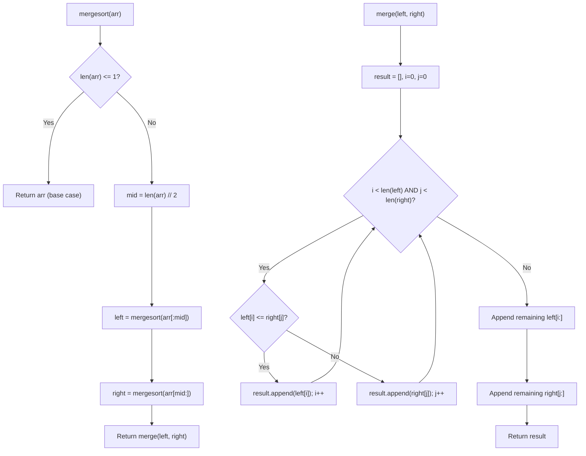

### Time Complexity
| Case | Complexity | Justification |
|------|-----------|---------------|
| **Best** | O(n log n) | Always divides in half (log n levels), n comparisons per level |
| **Average** | O(n log n) | Same as best — division is always equal |
| **Worst** | O(n log n) | Guaranteed — no input can cause worse performance |

### Space Complexity
- **O(n)** — temporary arrays created during merge step (total across all levels = n)

### Step-by-Step Walkthrough

**Input**: [38, 27, 43, 3, 9]

```
Split: [38, 27, 43, 3, 9]
       /                \
[38, 27, 43]        [3, 9]
   /      \          /   \
[38, 27]  [43]    [3]   [9]
 /    \
[38]  [27]

Merge back:
[38] + [27] → compare 38,27 → [27, 38]
[27, 38] + [43] → compare 27,43 → 27 first → compare 38,43 → [27, 38, 43]
[3] + [9] → compare 3,9 → [3, 9]
[27, 38, 43] + [3, 9]:
  compare 27,3 → 3
  compare 27,9 → 9
  compare 27,_ → 27, 38, 43
  Result: [3, 9, 27, 38, 43]
```

**Final result**: [3, 9, 27, 38, 43]

---

## 8. KMP (Knuth-Morris-Pratt) String Matching

### Explanation
KMP is an efficient string matching algorithm that uses a pre-computed failure function to avoid re-examining previously matched characters. When a mismatch occurs, the failure function tells us the longest prefix of the pattern that is also a suffix of the matched portion, allowing the pattern to shift intelligently.

**Aviation Application**: Searching passenger databases by partial name, PNR fragment, or flight number pattern without O(n×m) brute-force cost.

### Flowchart

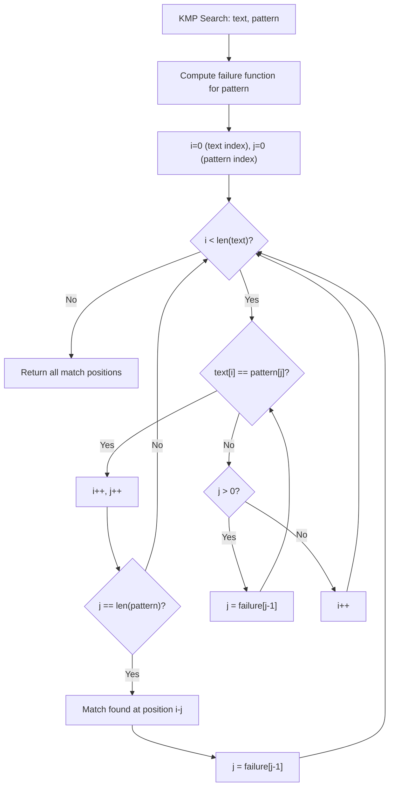

### Failure Function Construction

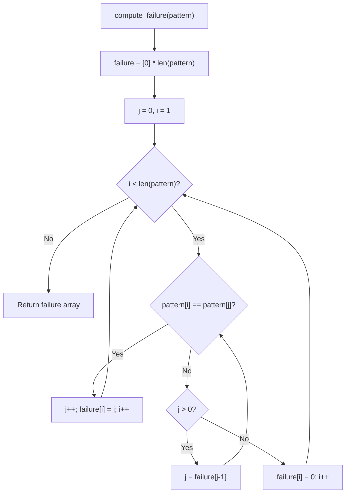

### Time Complexity
| Case | Complexity | Justification |
|------|-----------|---------------|
| **Best** | O(n + m) | Text pointer never goes backward; pattern shifts via failure function |
| **Average** | O(n + m) | Linear scan of text + linear failure function construction |
| **Worst** | O(n + m) | Even worst-case patterns (e.g., "aaa" in "aaaaaab") remain linear |

### Space Complexity
- **O(m)** — failure function array of pattern length

### Step-by-Step Walkthrough

**Text**: "ABABDABACDABABCABAB"  
**Pattern**: "ABABCABAB"

**Step 1: Compute failure function**
```
Pattern:  A B A B C A B A B
Index:    0 1 2 3 4 5 6 7 8
Failure:  0 0 1 2 0 1 2 3 4
```

**Step 2: Search**
| i | j | text[i] | pattern[j] | Action | Match? |
|---|---|---------|-----------|--------|--------|
| 0 | 0 | A | A | match, i++, j++ | — |
| 1 | 1 | B | B | match, i++, j++ | — |
| 2 | 2 | A | A | match, i++, j++ | — |
| 3 | 3 | B | B | match, i++, j++ | — |
| 4 | 4 | D | C | mismatch, j=failure[3]=2 | — |
| 4 | 2 | D | A | mismatch, j=failure[1]=0 | — |
| 4 | 0 | D | A | mismatch, j=0, i++ | — |
| 5 | 0 | A | A | match, i++, j++ | — |
| ... | | | | (continues) | |
| 10-18 | 0-8 | | | Full match found! | Position 10 |

**Result**: Pattern found at position 10

---

## 9. Recursive Backtracking (Route Finding)

### Explanation
Backtracking systematically explores all possible paths in the graph from source to destination, building paths incrementally and abandoning ("backtracking") a path as soon as it violates constraints (revisiting a node or passing through a closed airport). Returns all valid acyclic paths.

**Aviation Application**: Finding ALL alternative routes when an airport is closed due to emergency, enabling operations controllers to redirect flights.

### Flowchart

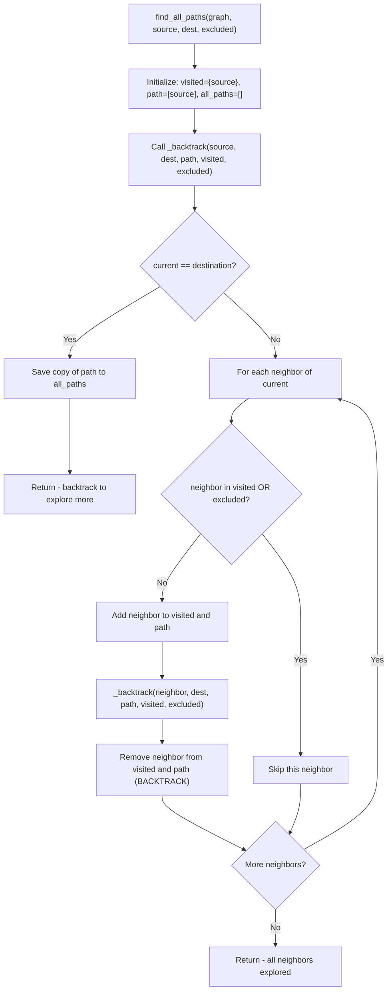

### Time Complexity
| Case | Complexity | Justification |
|------|-----------|---------------|
| **Best** | O(V + E) | Direct path exists; only explores one branch |
| **Average** | O(V × 2^V) | Exponential paths possible in dense graphs |
| **Worst** | O(V!) | Complete graph: every permutation is a valid path |

### Space Complexity
- **O(V)** — recursion stack depth + visited set (path never exceeds V nodes)

### Step-by-Step Walkthrough

**Network (CDG is closed):**
```
LHR --340-- CDG (CLOSED)
LHR --5500-- DXB
CDG --500-- JFK
DXB --800-- JFK
LHR --7000-- JFK
```

**Find all paths: LHR → JFK (excluding CDG)**

| Step | Current | Path | Visited | Action |
|------|---------|------|---------|--------|
| 1 | LHR | [LHR] | {LHR} | Explore neighbors: CDG(excluded), DXB, JFK |
| 2 | DXB | [LHR, DXB] | {LHR, DXB} | Explore neighbors: JFK, LHR(visited) |
| 3 | JFK | [LHR, DXB, JFK] | {LHR, DXB, JFK} | DESTINATION! Save path. |
| 4 | — | Backtrack to LHR | {LHR} | Continue with next neighbor: JFK |
| 5 | JFK | [LHR, JFK] | {LHR, JFK} | DESTINATION! Save path. |

**Results:**
1. LHR → DXB → JFK (distance: 5500 + 800 = 6300) 
2. LHR → JFK (distance: 7000) ★ Note: Path 1 is shorter

**Shortest labeled**: Path 1 (LHR → DXB → JFK, 6300 km)

---

## 10. Hash Function (Polynomial Rolling)

### Explanation
The polynomial rolling hash function converts a string key into an integer bucket index. Each character is weighted by a power of a prime number (31), providing good distribution across buckets.

**Formula**: `hash(key) = (Σ key[i] × 31^i) mod capacity`

**Aviation Application**: Converting PNR codes (e.g., "ABC123") to bucket indices for O(1) average-case passenger record lookup.

### Time Complexity
| Case | Complexity | Justification |
|------|-----------|---------------|
| **All cases** | O(k) | k = length of key string; iterate through each character |

### Space Complexity
- **O(1)** — single accumulator variable

### Step-by-Step Walkthrough

**Key**: "ABC", Capacity: 64

```
hash = 0
i=0: hash = (0 × 31 + ord('A')) % 64 = (0 + 65) % 64 = 1
i=1: hash = (1 × 31 + ord('B')) % 64 = (31 + 66) % 64 = 97 % 64 = 33
i=2: hash = (33 × 31 + ord('C')) % 64 = (1023 + 67) % 64 = 1090 % 64 = 2
```

**Result**: "ABC" maps to bucket index 2

---

## Comparative Algorithm Summary

| Algorithm | Type | Best | Average | Worst | Space | Stable? |
|-----------|------|------|---------|-------|-------|---------|
| Dijkstra | Graph/Greedy | O((V+E)log V) | O((V+E)log V) | O((V+E)log V) | O(V) | N/A |
| Prim's | Graph/Greedy | O(E log V) | O(E log V) | O(E log V) | O(V+E) | N/A |
| Kruskal's | Graph/Greedy | O(E log E) | O(E log E) | O(E log E) | O(V+E) | N/A |
| Heap Insert | Tree | O(1) | O(log n) | O(log n) | O(n) | Yes* |
| Heap Extract | Tree | O(log n) | O(log n) | O(log n) | O(n) | Yes* |
| AVL Insert | Tree | O(log n) | O(log n) | O(log n) | O(n) | N/A |
| QuickSort | Divide & Conquer | O(n log n) | O(n log n) | O(n²) | O(log n) | No |
| MergeSort | Divide & Conquer | O(n log n) | O(n log n) | O(n log n) | O(n) | Yes |
| KMP | String | O(n+m) | O(n+m) | O(n+m) | O(m) | N/A |
| Backtracking | Exhaustive | O(V+E) | O(V×2^V) | O(V!) | O(V) | N/A |

*Stable within same priority via sequence numbering
