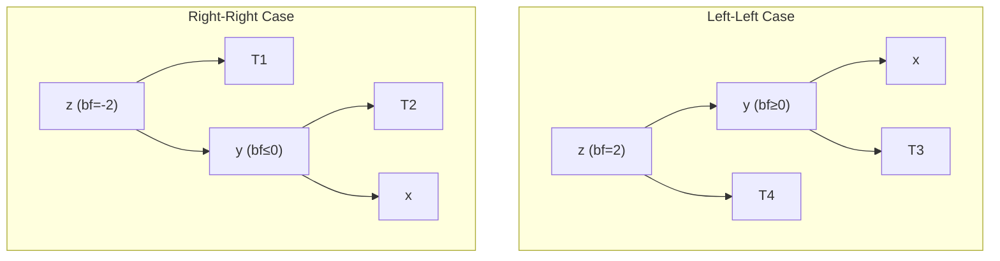

# Data Structures Design — SkyNet Aviation Logistics

## Overview

This document provides detailed analysis of each data structure implemented in SkyNet, covering purpose, real-world application, implementation approach, key operations, and complexity analysis.

---

## 1. Weighted Graph (Adjacency List)

### Purpose
Represents the flight network where airports are vertices and flight routes are weighted edges (distances in kilometres). Enables shortest path computation, minimum spanning tree construction, and network connectivity analysis.

### Real-World Application
- Modelling airline route networks with distances/costs as edge weights
- Computing optimal flight paths for routing passengers and cargo
- Identifying the minimum-cost subset of routes to connect all airports
- Detecting isolated airports (disconnected components)

### Implementation Approach
- **Storage**: `Dict[str, List[Tuple[str, int]]]` — dictionary mapping each airport (IATA code) to a list of (neighbour, weight) tuples
- **Bidirectional**: Adding edge (A, B, w) adds B to A's adjacency list AND A to B's adjacency list
- **Node metadata**: Separate `Dict[str, Airport]` stores airport details (name, city)
- **No self-loops**: Edges between identical nodes are rejected

### Key Operations

| Operation | Description | Time Complexity |
|-----------|-------------|----------------|
| `add_node(airport)` | Add airport vertex to graph | O(1) |
| `remove_node(iata)` | Remove vertex and all incident edges | O(V + E) |
| `add_edge(src, dest, weight)` | Add bidirectional weighted edge | O(1) |
| `remove_edge(src, dest)` | Remove edge preserving both nodes | O(degree) |
| `get_neighbors(iata)` | Return adjacency list for node | O(1) |
| `has_node(iata)` | Check if node exists | O(1) |
| `has_edge(src, dest)` | Check if edge exists | O(degree) |
| `node_count()` | Return number of vertices | O(1) |
| `edge_count()` | Return number of edges | O(V) |
| `display()` | Display adjacency list | O(V + E) |

### Complexity Analysis
- **Space**: O(V + E) — V node entries + 2E edge entries (bidirectional)
- **Time (add node)**: O(1) amortized — dictionary insertion
- **Time (add edge)**: O(1) — append to two adjacency lists
- **Time (remove node)**: O(V + E) — must scan all adjacency lists to remove references
- **Time (remove edge)**: O(degree(src) + degree(dest)) — linear scan of two adjacency lists

---

## 2. Max-Heap (Priority Queue)

### Purpose
Implements a priority queue where the element with the highest priority value is always at the root. Supports stable ordering (FIFO) among elements with equal priority.

### Real-World Application
- Passenger check-in processing: Platinum > Gold > Silver > Economy
- Earlier arrivals within same priority class are served first
- Efficient priority-based scheduling in O(log n) per operation

### Implementation Approach
- **Storage**: `List[Tuple[int, int, Any]]` — Python list storing (priority_value, -sequence_number, item) tuples
- **Ordering**: Python tuple comparison naturally orders by priority first, then by -sequence (earlier = higher = served first)
- **Complete binary tree**: Implicit in array — parent at index `(i-1)//2`, children at `2i+1` and `2i+2`
- **Heap property**: Every parent has priority ≥ both children

### Key Operations

| Operation | Description | Time Complexity |
|-----------|-------------|----------------|
| `insert(item, priority)` | Add item, sift up to restore heap | O(log n) |
| `extract_max()` | Remove and return highest-priority item | O(log n) |
| `peek()` | Return highest-priority item without removal | O(1) |
| `is_empty()` | Check if heap contains no elements | O(1) |
| `size()` | Return number of elements | O(1) |
| `display()` | Show all elements with priorities | O(n) |

### Internal Operations
- **`_sift_up(index)`**: Bubble element upward while it exceeds its parent — O(log n)
- **`_sift_down(index)`**: Bubble element downward to the larger child — O(log n)

### Complexity Analysis
- **Space**: O(n) — array of n elements
- **Insert**: O(log n) worst case — element may bubble to root (height = log n)
- **Extract-Max**: O(log n) — swap root with last, sift down through height
- **Peek**: O(1) — root is always at index 0
- **Build heap from n elements**: O(n) using bottom-up construction

---

## 3. FIFO Queue (Linked List)

### Purpose
Implements first-in-first-out ordering for the boarding gate, ensuring passengers board in the exact order they joined the queue regardless of priority class.

### Real-World Application
- Aircraft boarding in arrival order at the gate
- Fair sequential processing without priority override
- Duplicate prevention (passenger cannot join queue twice)

### Implementation Approach
- **Storage**: Singly linked list with `QueueNode` objects (data, identifier, next)
- **Pointers**: `_head` (front of queue, dequeue here) and `_tail` (rear of queue, enqueue here)
- **Duplicate tracking**: `Set[str]` of member identifiers for O(1) duplicate detection
- **Size tracking**: Integer counter updated on enqueue/dequeue

### Key Operations

| Operation | Description | Time Complexity |
|-----------|-------------|----------------|
| `enqueue(item, identifier)` | Add to rear of queue | O(1) |
| `dequeue()` | Remove and return front item | O(1) |
| `peek()` | Return front item without removal | O(1) |
| `contains(identifier)` | Check if identifier is in queue | O(1) |
| `is_empty()` | Check if queue is empty | O(1) |
| `size()` | Return number of elements | O(1) |
| `display()` | Show all elements front to rear | O(n) |

### Complexity Analysis
- **Space**: O(n) — n linked list nodes + set of n identifiers
- **Enqueue**: O(1) — update tail pointer and set
- **Dequeue**: O(1) — update head pointer and remove from set
- **Contains**: O(1) — set membership test
- **Display**: O(n) — traverse entire list

---

## 4. LIFO Stack (Array-Based)

### Purpose
Implements last-in-first-out ordering for cargo container management, where the most recently loaded container is on top and must be unloaded first.

### Real-World Application
- Aircraft cargo hold loading: containers stacked vertically
- Most recent item is only accessible item (physical constraint)
- Undo/redo operations in flight management systems

### Implementation Approach
- **Storage**: Python `list` used as dynamic array
- **Top of stack**: End of the list (index -1)
- **Push**: `list.append()` — O(1) amortized
- **Pop**: `list.pop()` — O(1)

### Key Operations

| Operation | Description | Time Complexity |
|-----------|-------------|----------------|
| `push(item)` | Add item to top of stack | O(1) amortized |
| `pop()` | Remove and return top item | O(1) |
| `peek()` | Return top item without removal | O(1) |
| `is_empty()` | Check if stack is empty | O(1) |
| `size()` | Return number of elements | O(1) |
| `display()` | Show all items top to bottom | O(n) |

### Complexity Analysis
- **Space**: O(n) — array of n elements
- **Push**: O(1) amortized — occasional O(n) for array resizing
- **Pop**: O(1) — remove from end, no shifting needed
- **Peek**: O(1) — access last element by index

---

## 5. AVL Tree (Self-Balancing BST)

### Purpose
Implements a self-balancing binary search tree for flight price storage, guaranteeing O(log n) search, insert, and delete operations. Supports efficient range queries for price comparisons.

### Real-World Application
- Flight price database with guaranteed fast lookups
- Range queries: "find all flights between £200 and £500"
- Ordered traversal for price reports (cheapest to most expensive)
- Handles dynamic pricing with frequent insertions/deletions

### Implementation Approach
- **Nodes**: `AVLNode` with key (price), records list, left/right children, height
- **Balance factor**: `height(left) - height(right)` maintained in {-1, 0, 1}
- **Rotations**: Four cases (LL, LR, RR, RL) to restore balance after modification
- **Duplicate keys**: Multiple records stored in same node's records list
- **Height tracking**: Each node stores its height; updated after every modification

### Key Operations

| Operation | Description | Time Complexity |
|-----------|-------------|----------------|
| `insert(record)` | Insert by price key, rebalance | O(log n) |
| `delete(price)` | Remove record by price, rebalance | O(log n) |
| `search(price)` | Find record by exact price | O(log n) |
| `range_search(min, max)` | Find all records in price range | O(log n + k) |
| `in_order_traversal()` | Return all records sorted by price | O(n) |
| `display()` | Visual tree representation | O(n) |

### Rotation Cases

### Complexity Analysis
- **Space**: O(n) — n nodes with constant overhead per node (height, two pointers)
- **Height**: Bounded by 1.44 × log₂(n + 2) — guarantees logarithmic operations
- **Insert**: O(log n) — traverse to leaf + at most 2 rotations on path to root
- **Delete**: O(log n) — find + remove + at most O(log n) rotations on path to root
- **Search**: O(log n) — binary search tree property
- **Range search**: O(log n + k) — find start point + visit k matching nodes

---

## 6. Hash Table (Separate Chaining)

### Purpose
Implements a key-value store for passenger records with O(1) average-case lookup by PNR (Passenger Name Record). Handles collisions through separate chaining.

### Real-World Application
- Instant passenger record retrieval by booking reference
- Airline reservation systems with millions of records
- Customer service lookup requiring sub-millisecond response

### Implementation Approach
- **Storage**: `List[List[Tuple[str, Any]]]` — array of buckets, each bucket is a list of (key, value) pairs
- **Hash function**: Polynomial rolling hash with prime=31: `hash = Σ(char × 31^i) mod capacity`
- **Collision resolution**: Separate chaining — colliding entries stored in same bucket's list
- **Initial capacity**: Fixed-size bucket array (e.g., 64 buckets)

### Key Operations

| Operation | Description | Time Complexity (Average) | Time Complexity (Worst) |
|-----------|-------------|--------------------------|------------------------|
| `insert(key, value)` | Add record by PNR key | O(1) | O(n) |
| `delete(key)` | Remove record by PNR | O(1) | O(n) |
| `search(key)` | Find record by PNR | O(1) | O(n) |
| `update(key, value)` | Modify existing record | O(1) | O(n) |
| `is_empty()` | Check if table is empty | O(1) | O(1) |
| `size()` | Return number of records | O(1) | O(1) |
| `display()` | Show bucket structure | O(n + m) | O(n + m) |

### Complexity Analysis
- **Space**: O(n + m) — m buckets + n stored entries
- **Average case**: O(1) — assuming good hash distribution, expected chain length = n/m (load factor)
- **Worst case**: O(n) — all keys hash to same bucket (degenerate case)
- **Load factor**: α = n/m; performance degrades when α > 0.75
- **Hash function**: O(k) where k = key length — polynomial rolling computation

---

## 7. Union-Find (Disjoint Set)

### Purpose
Efficiently tracks connected components during Kruskal's MST algorithm. Determines whether adding an edge would create a cycle by checking if both endpoints are in the same set.

### Real-World Application
- Network connectivity analysis for route planning
- Cycle detection in route networks
- Efficiently grouping airports into connected components

### Implementation Approach
- **Storage**: `Dict[str, str]` for parent pointers + `Dict[str, int]` for rank
- **Path compression**: During `find`, point all visited nodes directly to root
- **Union by rank**: Attach shorter tree under root of taller tree

### Key Operations

| Operation | Description | Time Complexity |
|-----------|-------------|----------------|
| `make_set(item)` | Create singleton set | O(1) |
| `find(item)` | Find root with path compression | O(α(n)) ≈ O(1) |
| `union(a, b)` | Merge two sets by rank | O(α(n)) ≈ O(1) |

### Complexity Analysis
- **Space**: O(n) — two dictionaries with n entries each
- **Time**: O(α(n)) amortized per operation — α is the inverse Ackermann function, effectively constant (≤ 4 for all practical n)
- **Path compression** reduces tree height; **union by rank** prevents degenerate chains

---

## 8. Failure Function Array (KMP)

### Purpose
Pre-computed array storing the length of the longest proper prefix of the pattern that is also a suffix, enabling the KMP algorithm to avoid re-scanning matched characters.

### Real-World Application
- Efficient passenger name search across large databases
- PNR fragment matching for customer service
- Flight number pattern matching in booking systems

### Implementation Approach
- **Storage**: `List[int]` of length m (pattern length)
- **Construction**: Linear scan comparing prefix/suffix overlaps
- **Usage**: When mismatch occurs at position j, shift pattern by j - failure[j-1] positions

### Key Operations

| Operation | Description | Time Complexity |
|-----------|-------------|----------------|
| `compute_failure_function(pattern)` | Build failure array | O(m) |
| `search(text, pattern)` | Find all occurrences | O(n + m) |

### Complexity Analysis
- **Space**: O(m) — failure array of pattern length
- **Preprocessing**: O(m) — single pass through pattern
- **Search**: O(n) — single pass through text (no backtracking)
- **Total**: O(n + m) — linear in combined input size

---

## Comparative Summary

| Data Structure | Insert | Delete | Search | Space | Best For |
|---------------|--------|--------|--------|-------|----------|
| Weighted Graph | O(1) | O(V+E) | O(1) | O(V+E) | Network modelling |
| Max-Heap | O(log n) | O(log n) | O(n) | O(n) | Priority scheduling |
| FIFO Queue | O(1) | O(1) | O(n) | O(n) | Sequential processing |
| LIFO Stack | O(1) | O(1) | O(n) | O(n) | LIFO operations |
| AVL Tree | O(log n) | O(log n) | O(log n) | O(n) | Ordered data with range queries |
| Hash Table | O(1) avg | O(1) avg | O(1) avg | O(n+m) | Key-value lookup |
| Union-Find | O(α(n)) | N/A | O(α(n)) | O(n) | Connectivity/component tracking |
