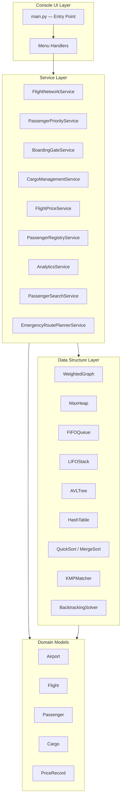
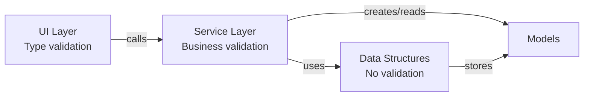

# SkyNet — Global Aviation Logistics & Management System

## Project Analysis

### Executive Summary

SkyNet is a comprehensive Global Aviation Logistics & Management System implemented as a modular Python console application. The system demonstrates mastery of data structures and algorithms through nine interconnected aviation-domain subsystems, each showcasing specific computational techniques in a real-world context.

The project is designed to achieve **Distinction grade** for an HNC/HND Data Structures and Algorithms unit by demonstrating:
- Deep understanding of abstract data types and their operations
- Correct implementation of complex algorithms with appropriate data structures
- Formal complexity analysis (time and space)
- Empirical performance evaluation across multiple dataset sizes
- Critical evaluation of relationships between data structures and algorithms

---

## System Architecture

### High-Level Architecture Diagram



### Layered Dependency Flow



**Rules:**
1. UI layer calls service methods only — never instantiates or accesses data structures directly
2. Service layer orchestrates data structure operations and model creation
3. Data structures are generic — they store model objects but don't depend on specific model types
4. Models are pure data classes with no dependencies on data structures or services

---

## Nine Subsystems

### 1. Flight Network System (Weighted Graph)
**Data Structure:** Adjacency List Weighted Graph  
**Algorithms:** Dijkstra's Shortest Path, Prim's MST, Kruskal's MST  
**Aviation Context:** Models airports as vertices and flight routes as weighted edges (distance in km). Enables route optimization, network analysis, and cost-efficient route subset identification.

### 2. Passenger Priority System (Max-Heap)
**Data Structure:** Max-Heap Priority Queue  
**Algorithms:** Heap Insert (sift-up), Heap Extract-Max (sift-down)  
**Aviation Context:** Manages passenger check-in ordering by priority class (Platinum > Gold > Silver > Economy) with FIFO within same priority.

### 3. Boarding Gate System (FIFO Queue)
**Data Structure:** Linked-List Queue  
**Algorithms:** Enqueue, Dequeue  
**Aviation Context:** Manages the boarding process in strict first-come-first-served order regardless of passenger priority.

### 4. Cargo Management System (LIFO Stack)
**Data Structure:** Array-based Stack  
**Algorithms:** Push, Pop, Peek  
**Aviation Context:** Models cargo container loading/unloading where the last container loaded must be the first one unloaded (aircraft hold constraints).

### 5. Flight Price Database (AVL Tree)
**Data Structure:** Self-Balancing AVL Binary Search Tree  
**Algorithms:** AVL Insert with rotations (LL, LR, RR, RL), AVL Delete, Range Search  
**Aviation Context:** Stores flight pricing data with efficient O(log n) lookup and range queries for price comparison analytics.

### 6. Passenger Registry (Hash Table)
**Data Structure:** Hash Table with Separate Chaining  
**Algorithms:** Polynomial Rolling Hash, Insert, Lookup, Delete with collision handling  
**Aviation Context:** Manages passenger records by PNR (Passenger Name Record) with O(1) average-case CRUD operations.

### 7. Analytics System (Sorting)
**Data Structure:** Array  
**Algorithms:** QuickSort (last-element pivot), MergeSort (divide-and-conquer)  
**Aviation Context:** Sorts flight and passenger data for reporting, with empirical performance comparison between algorithms.

### 8. Passenger Search System (String Matching)
**Data Structure:** Failure Function Array  
**Algorithms:** KMP (Knuth-Morris-Pratt) Pattern Matching  
**Aviation Context:** Enables efficient partial-text search across passenger names, PNRs, and flight numbers for customer service operations.

### 9. Emergency Route Planner (Backtracking)
**Data Structure:** Recursion Stack with Visited Set  
**Algorithms:** Recursive Backtracking with constraint exclusion  
**Aviation Context:** Finds all alternative flight routes when an airport is closed due to emergencies, marking the shortest alternative.

---

## Package Structure

```
skynet/
├── __init__.py
├── main.py                     # Entry point, main menu loop
├── models/                     # Domain data models
│   ├── airport.py              # Airport (IATA code, name, city)
│   ├── flight.py               # Flight route (origin, destination, distance)
│   ├── passenger.py            # Passenger (PNR, name, flight, seat, priority)
│   ├── cargo.py                # Cargo item (ID, description, weight)
│   ├── price_record.py         # Price record (origin, dest, price, currency)
│   ├── base.py                 # DataStructureBase abstract class
│   └── operation_result.py     # Standard OperationResult type
├── graph/                      # Graph data structure and algorithms
│   ├── weighted_graph.py       # Adjacency list weighted graph
│   ├── dijkstra.py             # Dijkstra's shortest path
│   ├── mst_base.py             # Abstract MST interface
│   ├── prim.py                 # Prim's MST
│   ├── kruskal.py              # Kruskal's MST
│   └── union_find.py           # Union-Find with path compression
├── heap/                       # Heap data structure
│   └── max_heap.py             # Max-heap priority queue
├── queue/                      # Queue data structure
│   └── fifo_queue.py           # Linked-list FIFO queue
├── stack/                      # Stack data structure
│   └── lifo_stack.py           # Array-based LIFO stack
├── tree/                       # Tree data structure
│   ├── avl_tree.py             # AVL tree with rotations
│   └── avl_node.py             # AVL tree node
├── hashing/                    # Hash table data structure
│   └── hash_table.py           # Hash table with separate chaining
├── sorting/                    # Sorting algorithms
│   ├── sort_base.py            # Abstract sorting interface
│   ├── quicksort.py            # QuickSort (last-element pivot)
│   └── mergesort.py            # MergeSort (divide-and-conquer)
├── string_matching/            # String matching algorithms
│   └── kmp.py                  # KMP with failure function
├── backtracking/               # Backtracking algorithms
│   └── route_finder.py         # Recursive route finder
├── services/                   # Business logic layer
│   ├── flight_network_service.py
│   ├── passenger_priority_service.py
│   ├── boarding_gate_service.py
│   ├── cargo_management_service.py
│   ├── flight_price_service.py
│   ├── passenger_registry_service.py
│   ├── analytics_service.py
│   ├── passenger_search_service.py
│   └── emergency_route_planner_service.py
├── utils/                      # Utility modules
│   ├── validators.py           # Input validation
│   ├── formatters.py           # Output formatting
│   └── performance.py          # Timing and memory measurement
└── ui/                         # User interface
    ├── menu.py                 # Menu display and navigation
    └── input_handler.py        # User input handling
```

---

## Assignment Requirements Mapping

| Subsystem | Data Structure | Key Algorithms | Grading Criteria Addressed |
|-----------|---------------|----------------|--------------------------|
| Flight Network | Weighted Graph (Adjacency List) | Dijkstra, Prim, Kruskal | P1, P2, P3, P4, M1, M2, M3, D1, D2, D3 |
| Passenger Priority | Max-Heap | Sift-up, Sift-down | P1, P2, P3, P4, M1, M2, M3, D1 |
| Boarding Gate | Linked-List Queue | Enqueue, Dequeue | P1, P3, P4, M1, M2, M3 |
| Cargo Management | Array Stack | Push, Pop | P1, P3, P4, M1, M2, M3 |
| Flight Price DB | AVL Tree | Rotations, Balanced Insert/Delete | P1, P2, P3, P4, M1, M2, M3, D1, D2 |
| Passenger Registry | Hash Table (Chaining) | Hash Function, Collision Resolution | P1, P3, P4, M1, M2, M3, D1 |
| Analytics | Array | QuickSort, MergeSort | P2, P4, M1, M2, M3, M4, M5, D2, D3 |
| Passenger Search | Failure Array | KMP Pattern Matching | P2, P4, M1, M2, M3, D3 |
| Emergency Routes | Recursion Stack | Backtracking | P2, P4, M1, M2, M3, D3 |

---

## Object-Oriented Design Principles

### Encapsulation
- All data structures have private internal storage (prefixed with `_`)
- Public interfaces expose only high-level operations
- No client code directly accesses internal arrays, linked list nodes, or tree pointers

### Inheritance
- `DataStructureBase` → MaxHeap, FIFOQueue, LIFOStack, AVLTree, HashTable
- `MSTAlgorithm` → PrimMST, KruskalMST
- `SortAlgorithm` → QuickSort, MergeSort

### Polymorphism
- MST algorithms: Prim and Kruskal interchangeable via common `compute_mst` interface
- Sorting algorithms: QuickSort and MergeSort interchangeable via common `sort` interface
- Data structures: all share `insert`, `delete`, `search`, `display` interface

### Abstraction
- Abstract base classes define contracts for data structures and algorithms
- Service layer abstracts complexity from UI layer
- Domain models are pure data classes independent of storage mechanisms

---

## Technology Stack

| Component | Technology | Justification |
|-----------|-----------|---------------|
| Language | Python 3.11 | Clear syntax for academic demonstration |
| Data Structures | Pure Python | Built from scratch to demonstrate understanding |
| Testing | pytest + Hypothesis | Industry-standard with property-based testing support |
| Documentation | Markdown + Mermaid | Portable, version-controlled, rendered diagrams |
| Interface | Console (text-based) | Focus on algorithms rather than UI complexity |
