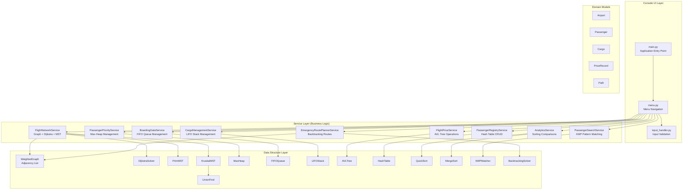
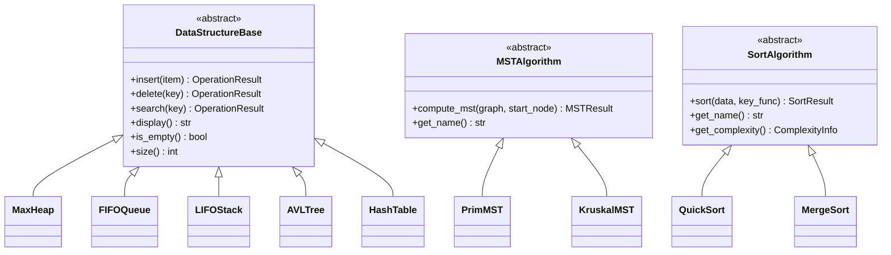
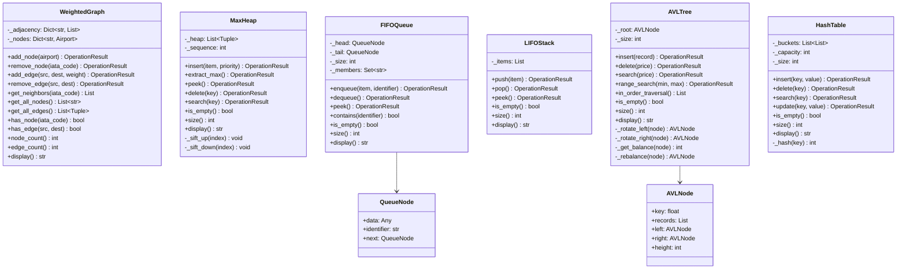
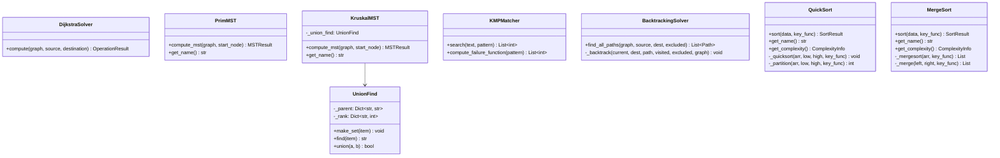
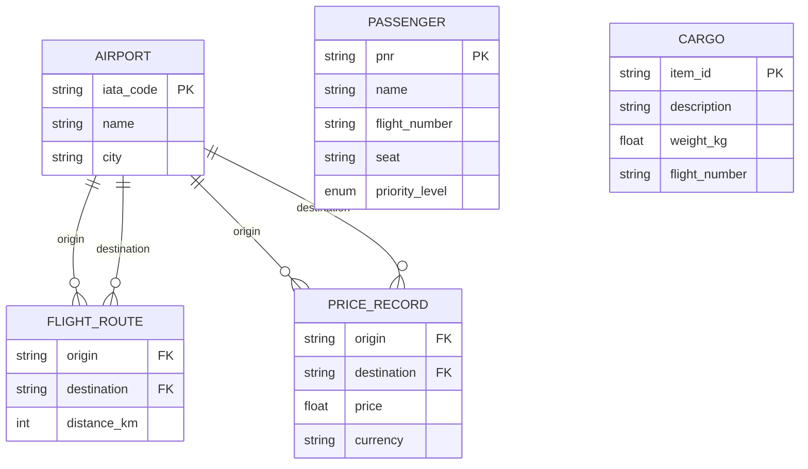
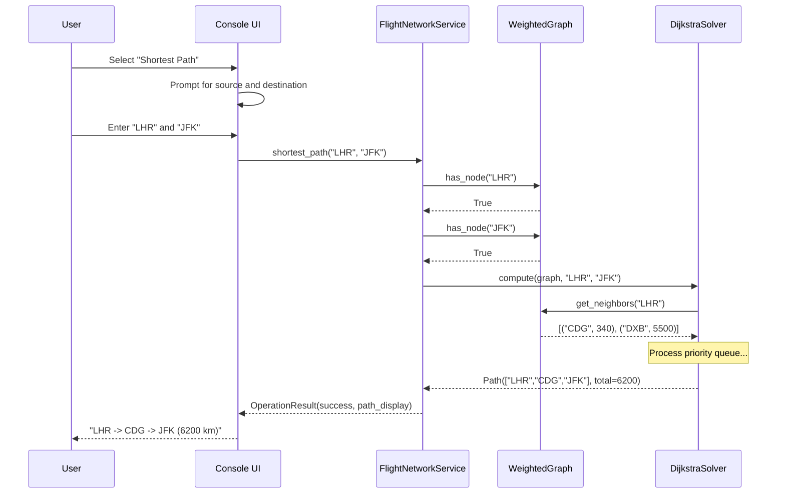
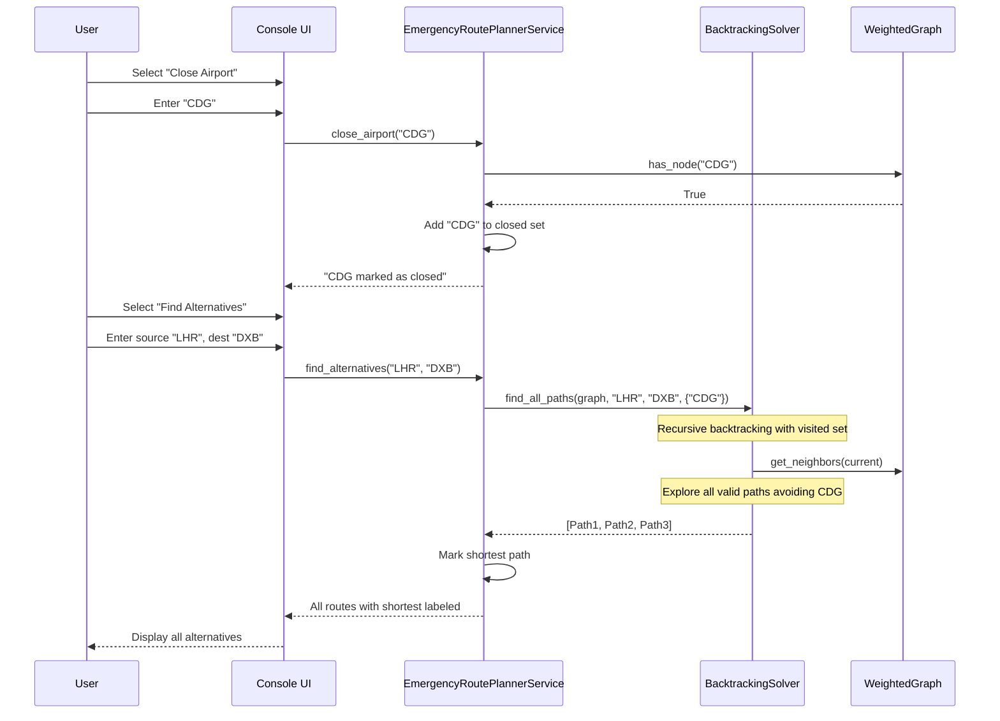
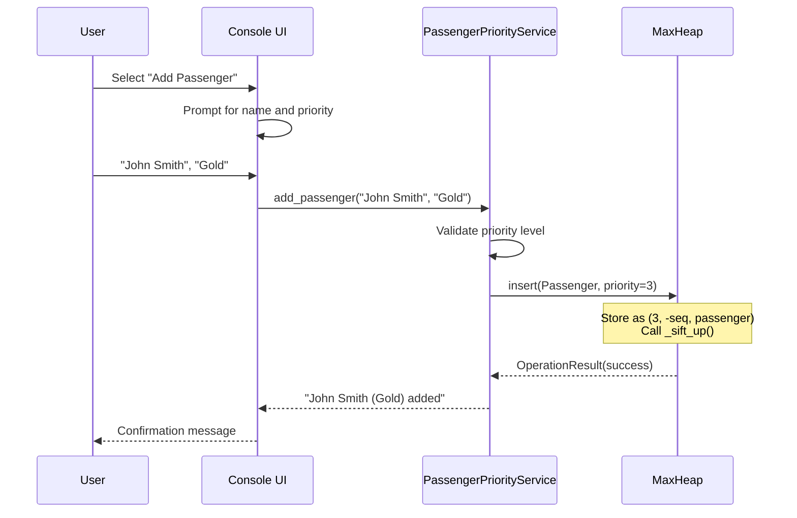
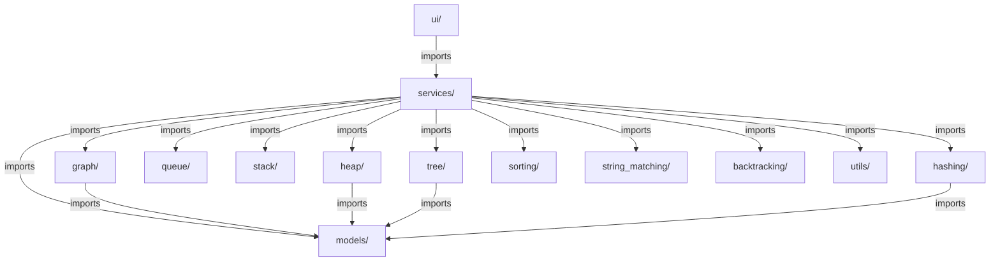

# System Design — SkyNet Aviation Logistics

## Architecture Overview

SkyNet follows a **three-layer architecture** pattern separating concerns across UI, Service, and Data Structure layers, with a shared Domain Model layer providing data transfer objects.

---

## High-Level System Architecture

---

## Class Hierarchy

### Abstract Base Classes

### Data Structure Classes

### Algorithm Classes

### Service Layer Classes

```mermaid
classDiagram
    class FlightNetworkService {
        -_graph: WeightedGraph
        -_dijkstra: DijkstraSolver
        -_prim: PrimMST
        -_kruskal: KruskalMST
        +add_airport(iata, name, city) OperationResult
        +remove_airport(iata) OperationResult
        +add_route(src, dest, distance) OperationResult
        +remove_route(src, dest) OperationResult
        +shortest_path(src, dest) OperationResult
        +compute_mst_prim(start) MSTResult
        +compute_mst_kruskal() MSTResult
        +display_network() str
    }

    class PassengerPriorityService {
        -_heap: MaxHeap
        +add_passenger(name, priority) OperationResult
        +process_next() OperationResult
        +peek_next() OperationResult
        +display_queue() str
    }

    class BoardingGateService {
        -_queue: FIFOQueue
        +add_to_boarding(passenger_id, name) OperationResult
        +board_next() OperationResult
        +display_queue() str
    }

    class CargoManagementService {
        -_stack: LIFOStack
        +load_cargo(item_id, description, weight) OperationResult
        +unload_cargo() OperationResult
        +peek_top() OperationResult
        +display_stack() str
    }

    class FlightPriceService {
        -_avl_tree: AVLTree
        +add_price(origin, dest, price) OperationResult
        +remove_price(price) OperationResult
        +search_price(price) OperationResult
        +range_search(min, max) OperationResult
        +display_prices() str
    }

    class PassengerRegistryService {
        -_hash_table: HashTable
        +create_record(pnr, name, flight, seat) OperationResult
        +search_record(pnr) OperationResult
        +update_record(pnr, fields) OperationResult
        +delete_record(pnr) OperationResult
        +display_registry() str
    }

    class AnalyticsService {
        -_quicksort: QuickSort
        -_mergesort: MergeSort
        +sort_with_quicksort(data, key_func) SortResult
        +sort_with_mergesort(data, key_func) SortResult
        +comparison_report(data, key_func) str
    }

    class PassengerSearchService {
        -_kmp: KMPMatcher
        -_registry: PassengerRegistryService
        +search_by_name(pattern) OperationResult
        +search_by_pnr(pattern) OperationResult
        +search_by_flight(pattern) OperationResult
    }

    class EmergencyRoutePlannerService {
        -_solver: BacktrackingSolver
        -_graph: WeightedGraph
        -_closed_airports: Set
        +close_airport(iata) OperationResult
        +reopen_airport(iata) OperationResult
        +find_alternatives(src, dest) OperationResult
    }
```

---

## Entity Relationship Diagram

---

## Sequence Diagrams

### Shortest Path Query

### Emergency Route Planning

### Priority Queue Passenger Flow

---

## Package Dependencies

---

## Design Patterns Used

| Pattern | Application | Benefit |
|---------|-------------|---------|
| **Strategy** | MSTAlgorithm, SortAlgorithm interfaces | Swap algorithms at runtime without changing service code |
| **Template Method** | DataStructureBase defining abstract operations | Common interface, specific implementations |
| **Composition** | Services compose data structures | Loose coupling, easy testing |
| **Facade** | Service layer hides data structure complexity | Simple API for UI layer |
| **Result Object** | OperationResult for all operations | Consistent error handling without exceptions |
